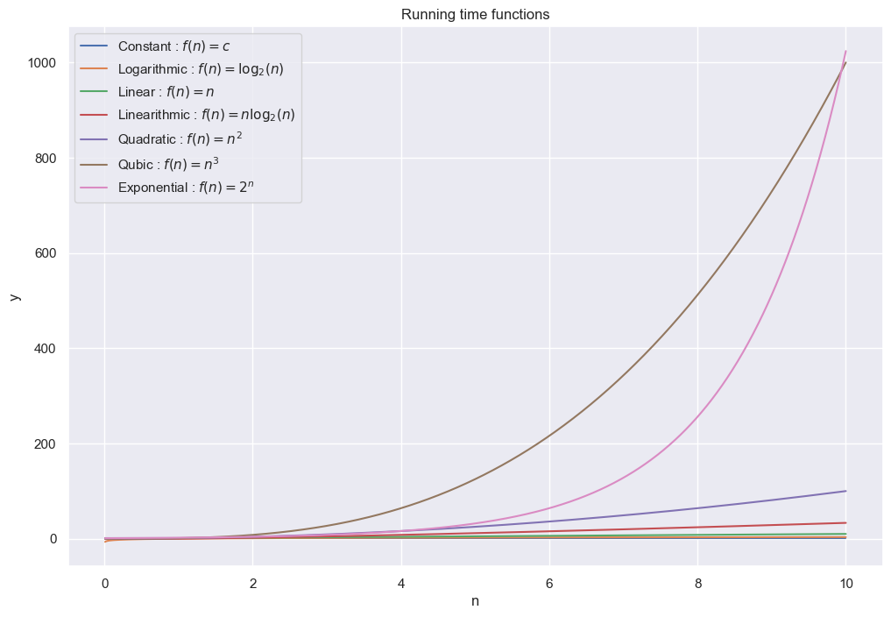
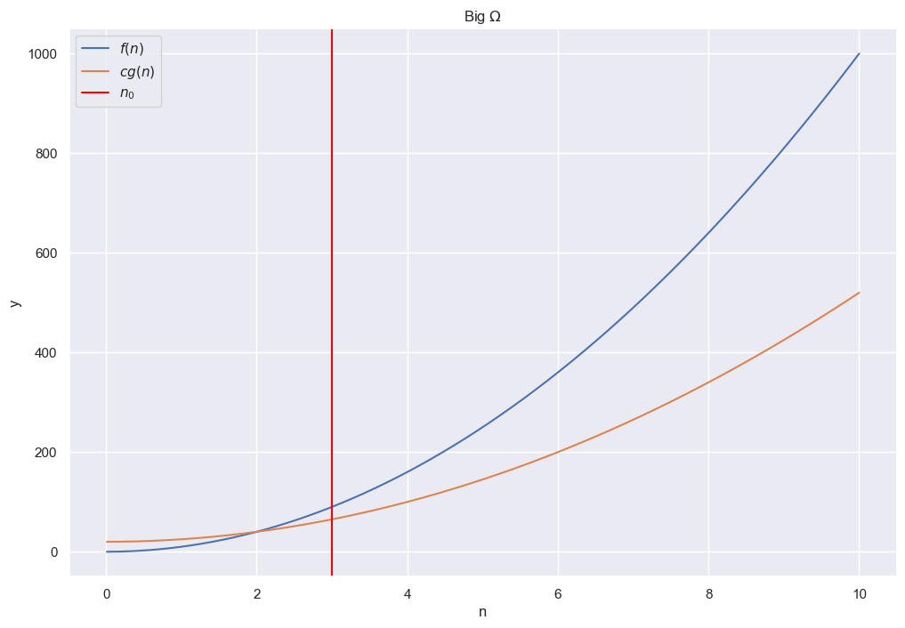
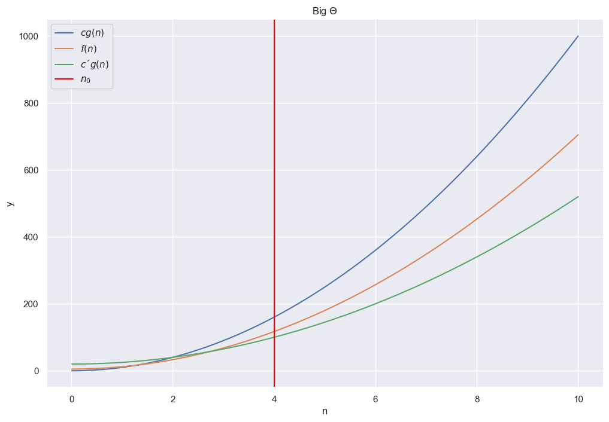

```python
import matplotlib.pyplot as plt
import seaborn as sns
import numpy as np

sns.set_theme()
```

# Running time analysis

In running time analysis we analyse the number of operations an algorithms needs. 
Often we look at upper or lower bounds of the amount of operations.


```python
running_times = {'Constant': lambda n : n**0,
                 'Logarithmic': lambda n : np.log2(n),
                 'Linear': lambda n : n,
                 'Linearithmic': lambda n : n * np.log2(n),
                 'Quadratic': lambda n : n ** 2,
                 'Qubic': lambda n : n ** 3,
                 'Exponential': lambda n : 2**n}
functions = [r'$f(n) = c$', r'$f(n) = \log_2(n)$', r'$f(n) = n$', r'$f(n) = n \log_2(n)$', r'$f(n) = n^2$', r'$f(n) = n^3$', r'$f(n) = 2^n$']
```


```python
n = np.linspace(0.01, 10, 1000)
```


```python
plt.figure(figsize=(12, 8))
plt.title('Running time functions')
for fl, fs in zip(running_times.keys(), functions):
    plt.plot(n, running_times[fl](n), label=f'{fl} : {fs}')
plt.xlabel('n')
plt.ylabel('y')
plt.legend()
plt.show();
```


    

    


# Big O


$$
O(g(n)) = \{ f | \exists c > 0 \exists n_0 > 0 \forall n \geq n_0: f(n) \leq c g(n) \}
$$


```python
f1 = lambda n : 10 * n**2
f2 = lambda n : 5 * n**2 + 20
```


```python
plt.figure(figsize=(12, 8))
plt.title(r'Big $O$')
plt.plot(n, f1(n), label=r'$cg(n)$')
plt.plot(n, f2(n), label=r'$f(n)$')
plt.axvline(x=3, label=r'$n_0$', color='red')
plt.legend()
plt.xlabel('n')
plt.ylabel('y')
plt.show();
```


    

    


# Big $\Omega$

$$
\Omega(g(n)) = \{ f | \exists c > 0 \exists n_0 > 0 \forall n \geq n_0: c g(n) \leq f(n) \}
$$


```python
plt.figure(figsize=(12, 8))
plt.title(r'Big $\Omega$')
plt.plot(n, f1(n), label=r'$f(n)$')
plt.plot(n, f2(n), label=r'$cg(n)$')
plt.axvline(x=3, label=r'$n_0$', color='red')
plt.legend()
plt.xlabel('n')
plt.ylabel('y')
plt.show();
```


    

    


# Big $\Theta$

$$
\Theta(g(n)) = \{ f | \exists c > 0 \exists c' > 0 \exists n_0 > 0 \forall n \geq n_0: c g(n) \leq f(n) \leq c' g(n) \}
$$


```python
f3 = lambda n : 7 * n**2 + 5
```


```python
plt.figure(figsize=(12, 8))
plt.title(r'Big $\Theta$')
plt.plot(n, f1(n), label=r'$cg(n)$')
plt.plot(n, f3(n), label=r'$f(n)$')
plt.plot(n, f2(n), label=r'$c´g(n)$')
plt.axvline(x=4, label=r'$n_0$', color='red')
plt.legend()
plt.xlabel('n')
plt.ylabel('y')
plt.show();
```


    

    


# Rules

1. $O(1) \subset O(\log_2 n) \subset O(n) \subset O(n \log_2 n) \subset O(n^2) \subset O(n^3) \subset O(2^n)$
2. If $f_1 \in O(g_1)$ and $f_2 \in O(g_2) \Rightarrow f_1 f_2 \in O(g_1 g_2)$ 
3. If $f_1 \in O(g_1)$ and $f_2 \in O(g_2) \Rightarrow f_1 + f_2 \in O(g_1 + g_2)$ 
4. If $f_1 \in O(g_1) \Leftrightarrow g_1 \in \Omega(f_1)$

# Substitution method

For the substitution method we guess the form of our solution and show the correctness through the use of induction.

Consider the following recursion $T(m) = 2 T(m/2) + \Theta(m)$ with $m = 2^k$, $k \in \mathbb{N}_{> 0}$.
Then by using substitution we get

$$
\begin{align*}
    T(m) 
    &=
    2 T(m/2) + c'm$ \\
    &=
    2 (2 T(m/4) + c'(m/2)) + \Theta(m)$ \\
    &=
    4 T(m/4) + 2c'm \\
    &=
    4 (2 T(m/8) + c'(m/4)) + 2c'm \\
    &=
    8 T(m/8) + 3 c'm \\
    &= 
    ... \\
    &=
    k c'm + 2^k c_0 \\
    &=
    c' m \log m + m c_0 \\
    &\leq 
    (c_0 + c')m \log_2 m
\end{align*}
$$

Thus we guess that our running time is upper bounded by $O(m \log_2 m)$.
Our hypothesis then becomes that our function is upper bounded $T(m) \leq c m \log_2 m$ for all $m\geq m_0$ for some $c, m_0 > 0$.
We do the inductive step $m - 1 \rightarrow m$, where $m \geq 2 m_0$

$$
\begin{align*}
    T(m)
    &=
    2 T(m/2) + c'm \\
    &\leq
    2 c(m/2) \log_2 (m/2) + c'm \\
    &=
    cm\log_2 m - cm \log_2 2 + c'm \\
    &=
    cm \log_2 m  - cm + c'm \\
    & \leq
    cm \log_2 m \quad \text{for} \ c > c'
\end{align*}
$$

Inductive steps works if we constrain c to be sufficiently large such that $cm \geq c′m$ for all $m \geq 2m_0$.

Now we need to show that $T(m) \leq cm\log_2 m$ for all $m$ with $m_0 \leq m \leq 2m_0$. 
Consider for this $m_0 = 2$.

Let $d = \max \{T(2), T(3)\}$.
Then $T(2) \leq d \leq d 2 \log_2 2$ and $T(3) \leq d \leq d 3 \log_2 3$.
With $c = \max{c', d}$ it holds that for all $m \geq 2$ that

$$
T(m) \leq cm\log_2 m
$$

# Recursion Tree Method

In the recursion tree method, each node represents the cost of a single subproblem in the recursive invocation.
Analyzing the cost on each level of the tree and the depth of the tree gives an idea of the overall running time.

# Master Theorem

The master theorem is often used for recurrent algorithms and is given by $T(n) = A T(n / B) + f(n)$. 
This is called the master recurrence, and the function $f(n)$ is called the driving function.
The master theorem compares the asymptotic growth of the driving function to the one of the watershed function $n^{\log_B A}$.

Let $A \geq 1, B > 1$ be constant and $f(n)$ be a driving function that is defined and nonnegative on all sufficiently large reals.
Let $T$ satisfy the master recurrence $T(n) = A T(n/B) + f(n)$. Then

$$
\begin{align*}
    & f(n) = O(n^{\log_B A - \epsilon}), $\epsilon > 0  \\
     \Rightarrow & T(n) = \Theta(n^{\log_B A}) \\
    & f(n) = \Theta(n^{\log_B A} \log_2^k n), k \geq 0  \\
    \Rightarrow & T(n) = \Theta(n^{\log_B A} \log_2^{k+1} n) \\
    & f(n) = \Omega(n^{\log_B A + \epsilon}), \epsilon > 0 \ \text{and} \ A f(n/B) \leq cf(n), c < 1 \ \text{and sufficiently large n} \\
    \Rightarrow & T(n) = \Theta(f(n))
\end{align*}
$$

# Floor and Ceilings

Ignoring floors and ceilings does not generally affect the order of growth of the solution of a divide-and-conquer recurrence.
