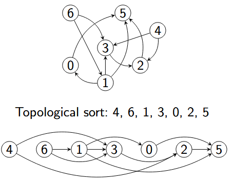

A graph is a pair $(V, E)$ comprising of $V$, being a finite set of vertices and $E$ being a finite set of edges. 
Every edge connects two vertices $u$ and $v$. 
In an undirected graph we have a $set\{u, v\}$ and in a directed graph we have a $pair(u, v)$. 
Multigraphs permit multiple parallel edges between the same nodes. 
Weighted graphs associate each edge with a weight.

Undirected graph terminology
- Neighbours of a vertex $u$: All vertices $v$ with $\{u, v\} \in E$
- Degree(v): Degree of a vertex = Amount of neighbours. In case of a self-loop the degree increases by 2

Directed graphs terminology
- Successors of vertex $u$: All vertices $v$ with $(u, v) \in E$
- Predecessors of vertex $u$: All vertices $v$ with $(v, u) \in E$
- outdegree(v): Amount of successors
- indegree(v): Amount of predecessors

Path and cycles
- Path of length n: Sequence $(v_0, ..., v_n)$ of vertices with $\{v_i, v_{i+1} \} \in E \ for \ i = 0, ..., n - 1$ or $(v_i, v_{i+1}) \in E \ for \ i = 0, ..., n - 1$. A path is simple if all vertices are distinct
- Cycle: Path with equal start and end vertex $(v_0 = v_n)$ for $n > 0$. The cycle is simple if all vertices $v_1, ..., v_n$ are distinct. If theres no simple cycle, then the graph is acyclic.

### Representation

The vertices are numbered with $0, ..., |V| - 1$. 
Then we can represent this with an Adjacency matrix. 
Graph $G = (\{0,... |V| - 1\})$ is then represented as a $|V| \times |V|$ matrix with entries $a_{ik}$ (row i, column k):

$$
a_{ik}
\begin{cases}
1 \ \text{if} \ (i, k) \in E \ \text{or} \ \{i, k\} \in E \\
0 \ \text{otherwise}
\end{cases}
$$

An undirected graph has a symmetric adjacency matrix.

As an Adjacency list, we store for every vertex in a linked list the list of successors / neighbours

The complexity of these representations is

|                             | Adj. Matrix | Adj. list           |
|-----------------------------|-------------|---------------------|
| Space                       | $\| V \|^2$ | $\| E \| + \| V \|$ |
| Add edge                    | 1           | 1                   |
| Edge between u and v?       | 1           | (out)degree(v)      |
| Iterate over outgoing edges | $\| V \|$   | (out)degree(v)      |

### Graph exploration

Given a vertex $v$, we want to visit all vertices that are reachable from $v$.

#### Depth-first search (DFS)

Go deep into the graph, away from $v$. 
We mark every visited vertices. 
We start at v and iterate over the successorts/neighbours $w$ of $v$. 
Then if $w$ not marked, start recursively from $w$
We visit successor in increasing order of their number. 
If we reach an end start from second node.


```python
def depth_first_exploration(graph, node, visited=None):
    if visited is None:
        visited = set()
    if node in visited():
        return 
    visited.add(node)
    for s in graph.successors(node):
        depth_first_exploration(graph, s, visited)
```

- $\texttt{Preorder}$: Vertex is included before ts children are considered
- $\texttt{Postorder}$: Vertex is included when the recursive depth first search of all its childern has finished
- $\texttt{Reverse Postorder}$ Like post order but in reverse order.


```python
def depth_first_exploration(graph, node, preorder, postorder, reverse_postorder, visited=None):
    if visited is None:
        visited = set()
    if node in visited():
        return 
    preorder.append(node) # <- Preorder add location
    visited.add(node)
    for s in graph.successors(node):
        depth_first_exploration(graph, s, preorder, postorder, reverse_postorder, visited)
        
    postorder.append(node) # <- Postorder add location
    reverse_postorder.appendleft(node) # <- Reverse Postorder add location
```


```python
def depth_first_exploration(graph, node):
    visited = set()
    stack = deque()
    stack.append(node)
    
    while stack:
        v = stack.pop() #Last in first out
        if v not in visited:
            visited.add(v)
            for s in graph.successors(v):
                stack.append(s)
```

### Breadth-first Search (BFS)

First mark all neighbours, then neighbours of neighbours and so on.
1. Mark $v$ (Distance 0)
2. Mark all unmarked successors/neighbours of $v$ (Distance 1)
3. Mark all unmarked successors/neighbours of distance-1 vertices 
...
4. Mark all unmarked successors/neighbours of distance-i vertices


```python
def breadth_first_exploration(graph, node):
    visited = set()
    queue = deque()
    queue.append(node)
    while queue:
        v = queue.popleft() #First in first out
        if v not in visited:
            visited.add(v)
            for s in graph.successors(v):
                queue.append(s)
                
# Slightly more efficient
def breadth_first_exploration(graph, node):
    visited = set()
    queue = deque()
    queue.append(node)
    while queue:
        v = queue.popleft() #First in first out
        for s in graph.successors(v):
            if s not in visited:
                queue.append(s)
                visited.add(v)
```

The running time is given by

$$
O(|V| + |E|)
$$

### Induced Search Tree

The induces search tree of a graph exploration contains for every visited vertex an edge from its predecessor in the exploration. Every vertex has at most one predecessor in the tree. Represent induced search tree by the predecessor relation. The visited vertices are exactly those for which there is a predecessor set.


```python
def bfs_with_predecessors(graph, node):
    predecessor = [None] * graph.no_nodes()
    queue = deque()
    
    predecessor[node] = node
    queue.append(node)
    while queue:
        v = queue.popleft() #FIFO
        for s in graph.successors(v):
            if predecessor[s] is None:
                predecessor[s] = v
                queue.append(s)
```

# Single-source Shortest-paths (SSSP)

In SSSP we want to find the shortest paths between a given vertex $v$ and all vertices in the graph.
How we implement this is by doing Breadth first search visits to the vertices with increasing (minimal) distance from the start vertex.
The first visit of a vertex happens on shortest path
We could then use the induced search tree to get the shortest path.

So given a Graph and the starting vertex $s$, query for vertex $v$ and check if there is a path from $s$ to $v$.
If there is, then what is the shortest path


```python
class SingleSourceShortestPaths:
    def __init__(self, graph, start_node):
        # define predecessor tree
        self.predecessor = dict()
        
        # Initialize first node as first in tree
        self.predecessor[start_node] = start_node
        
        # Breadth first search with predecessor used for detection of nodes
        queue = deque()
        queue.append(start_node)
        while queue:
            v = queue.popleft()
            # iterate over all nodes which the current node v points to
            for s in graph.successors(v):
                # If node not yet in predecessor search tree
                if self.predecessor[s] is None:
                    # Add node to search tree
                    self.predecessor[s] = v
                    # Add node deque to check it's connections
                    queue.append(s)
    
    # If node isn't in the predecessor then there is no route 
    # starting from the starting node that connects to the given node
    def has_path_to(self, node):
        return self.predecessor[node] is not None

    
    def get_path_to(self, node):
        # Check if starting node has a path to the given node
        if not self.has_path_to(node):
            return None
        # Check if starting node is the given node (If node has no predecessor, it is its own predecessor)
        if self.predecessor[node] == node:
            return node
        
        # Get the previous node which connects to the given node
        pre = self.predecessor[node]
        path = self.get_path_to(pre)
        path.append(node)
```

# Acyclic Graphs

A directed acyclic graph (DAG) is a directed graph that contains no directed cycles.
We would then given a graph like to know if it contains a acyclic directed cycle or not.
When looking at induced search trees of a depth-first search, if the induces search tree has no back edges (no edges which go back to a previous node already in the induced tree) then the graph is acyclic.


```python
class DirectedCycle:
    def __init__(self, graph):
        # define predecessor tree
        self.predecessor = dict()
        
        # 
        self.on_current_path = set()
        
        #
        self.cycle = None
        
        # Iterate over all nodes in graph view and perform DFS
        for node in graph.nodes:
            # Check if for current node we have a cycle in our graph
            if self.has_cycle():
                break
            # Add node to predecessor and perform DFS on node
            if node not in self.predecessor:
                self.predecessor[node] = node
                self.dfs(graph, node)

    # Checks if cycle has occured
    def has_cycle(self):
        return self.cycle is not None
    
    # Depth first search
    def dfs(self, graph, node):
        # Add current node to set
        self.on_current_path.add(node)
        # Iterate over all successors of node
        for s in graph.successors(node):
            if self.has_cycle():
                return
            # Check if s (successor) has already occurred during DFS, that is we visited it twice starting from a node
            # which means we traversed a cycle
            if s in self.on_current_path:
                self.predecessor[s] = node
                self.extract_cycle(s)
            # If successor not yet been visited we know we can continue our search
            # If it were already in self.predecessor, then it has already been visited and no cycle was present
            if s not in self.predecessor:
                self.predecessor[s] = node
                self.dfs(graph, s)
        # Remove node if it is a dead end
        self.on_current_path.remove(node)
        
    # Get cycle in graph
    def extract_cycle(self, node):
        self.cycle = deque()
        current = node
        self.cycle.appendleft(current)
        # Traverse induced search tree to get cycle
        while True:
            current = self.predecessor[current]
            self.cycle.appendleft(current)
            if current == node:
                return    
```

# Topological sort

A topological sort of directed acyclic graph $G = (V, E)$ is a linear ordering of all its vertices such that if $G$ contains an edge $(u, v)$, then $u$ appears before $v$ in the ordering



For the reachable part of an acyclic graph, the reverse DFS postorder is a topological sort.
We use DFS to visit all edges in reverse postorder


```python
def topological_sort(acyclic_digraph):
    visited = set()
    reverse_postorder = deque()
    for node in acyclic_digraph.nodes:
        depth_first_exploration(acyclic_digraph, node, visited, 
                                reverse_postorder)
    return reverse_postorder
```

# Connected Components

In an undirected graph, two vertices $u$ and $v$ are in the same connected component if there is a path between $u$ and $v$.


```python
class ConnectedComponents:
    # Initialization with precomputation
    def __init__(self, graph):
        # Gives each node an id -> id of which component it belongs to
        self.id = [None] * graph.number_of_nodes()
        # Initialize an id for connected components
        self.curr_id = 0
        for node in graph.nodes:
            # Check if node already visited in previous DFS (Node already in connected component)
            if self.id[node] is None:
                self.dfs(graph, node)
                # After exploring full connected component, move to next connected component
                self.curr_id += 1

    # Depth-first search
    # Gives all connected nodes, which corresponds to one connected component
    def dfs(self, graph, node):
        if self.id[node] is not None:
            return
        # Give node id of current connected component
        self.id[node] = self.curr_id
        # Iterate over all of node successors
        for n in graph.neighbors(node):
            self.dfs(graph, n)
    
    # Check if two vertices are connected
    def connected(self, node1: int, node2: int) -> bool:
        return self.id[node1] == self.id[node2]
        
    # Count the number of connected components
    def count(self) -> int:
        ids = set()
        for id in self.id:
            if id not in ids:
                ids.add(id)
        return len(ids)
```

For a directed graph, if one ignores the directions then every connected component of the resulting undirected graph is a weakly connected component of the directed graph.
A directed graph is then strongly connected if there is a directed path from each vertex to each other vertex.


Strongly connected components can be found via the ***Kosaraju' algorithm***.
Given the directed Graph $G = (V, E)$, we compute the reverse postorder $P$ for all vertices of the graph.
That is, we invert all directions in our graph and then compute the post order on this inversed graph.

$$
G^R = (V, \{(v, u) | (u, v) \in E\})
$$

We then conduct a sequence of explorations in $G$, always selecting the first still unvisited vertex in $P$ as the next start vertex.
All vertices that are reached by the same exploration are in the same strongly connected component.


```python
def compute_strongly_connected_components(directed_graph):
    reversed_graph = directed_graph.reverse(False)
    
    # compute complete reverse postorder for reversed graph
    visited = set()
    reverse_postorder = deque()
    for node in reversed_graph.nodes:
        depth_first_exploration(reversed_graph, node, visited,
                                reverse_postorder)
        
    print(reverse_postorder)
    sccs = [] # should contain one entry for each strongly connected component

    # TODO determine the strongly connected components
    # Hint: you can collect the vertices that are newly
    # visited in an exploration from the corresponding reverse
    # postorder.
    reverse_visited = set()
    while reverse_postorder:
        reverse_node = reverse_postorder.pop()
        if not reverse_node in reverse_visited:
            l = deque()
            print('reverse node:',  reverse_node)
            depth_first_exploration(directed_graph, reverse_node, reverse_visited,
                                    l)
            sccs.append(l)
        
        
    
    return sccs
```

# Union find

Image that we have a set of connected components as a collection of disjoint sets of object.
One set then contains all vertices of one connected component.
We then would like to have the following operations on these different sets

1. $\texttt{Union}$: Given two objects, merge the sets that contain them into one. For this we introduce a new edge between two already existing vertices, joining their disjoint connected components.
2. $\texttt{Find}$: Given an object, return a representative of the set that it contains. That is given a vertex, we want to return a representative vertex of the connected component it belongs to.
    - We must return the same representative vertex for all vertexes in the set.
    - The representative may only change if the set is merged
    - Two objects are in the same set if $\texttt{Find}$ returns the same representative.
        
3. $\texttt{Count}$: Return the number of sets, i.e. the number of connected components.

## Quick-Find

For $n$ objects, use an array representative of length $n$. 
At each index $i$, we hold the representative of the set containing $i$.
At initialisation, every object is alone in its own set and thus its own representative.
We then update the array after every call of union.


```python
class QuickFind:
    def __init__(self, no_nodes):
        self.components = no_nodes
        self.representative = list(range(no_nodes))
        
    def count(self):
        return self.components
    
    def find(self, v):
        return self.representative[v]
    
    def union(self, v, w):
        # Get representative node of v and w
        repr_v = self.find(v)
        repr_w = self.find(w)
        
        # Check if both have same representative node
        if repr_v == repr_w:
            return 
        
        # Switch all nodes which have repr_v as representative to repr_w
        for i in range(len(self.representative)):
            if self.representative[i] == repr_v:
                self.representative[i] = repr_w
        self.components -= 1
```

For the running time we have between $n + 3$ and $2n+1$ accesses for every call of union that merges two components

# Quick-Union (Disjoint-set Forest)

We have a tree for representing each set.
Where each node used as a index indicates its parent. 
For example having the array $[0, 2, 0, 1, 4]$, then the node $0$ is a root, node $1$ connects to node $2$, node $2$ connects to $0$ etc.
The root node than serves as the representative.


```python
class QuickUnion:
    def __init__(self, no_nodes):
        self.parent = list(range(no_nodes))
        self.components = no_nodes
    
    def find(self, v):
        # Iterate over parent of node until node points to itself.
        # This then is the parent node of the component, thus the representative
        while self.parent[v] != v:
            v = self.parent
        return v
    
    def union(self, v, w):
        # Find representatives of nodes
        repr_v = self.find(v)
        repr_w = self.find(w)
        
        # Return if nodes are already in the same component
        if repr_v == repr_w:
            return 
        
        # Set parent of the representative to the other representative node 
        self.parent[repr_v] = repr_w
        self.components -= 1
```

A first problem with quick union is that the created trees during union can degenrate into chains.
To fix this during union the root of the tree with lower height becomes child of the root of the higher tree


```python
class RankedQuickUnion:
    def __init__(self, no_nodes):
        self.parent = list(range(no_nodes))
        self.components = no_nodes
        self.rank = [0] * no_nodes
       
    def find(self, v):
        # Iterate over parent of node until node points to itself.
        # This then is the parent node of the component, thus the representative
        while self.parent[v] != v:
            v = self.parent
        return v    
        
    def union(self, v, w):
        # Find representatives of nodes
        repr_v = self.find(v)
        repr_w = self.find(w)
        
        # Return if nodes are already in the same component
        if repr_v == repr_w:
            return 
    
        # Assign representative node with lower rank as child of the higher rank representative
        if self.rank[repr_w] < self.rank[repr_v]:
            self.parent[repr_w] = repr_v
        # Inverse
        else:
            self.parent[repr_v] = repr_w
            if self.parent[repr_v] == self.parent[repr_w]:
                self.rank[repr_w] += 1
```

A second improvement to quick union can be done in find by reconnecting all traversed nodes to the root.
Here we do not update the height of the tree during path compression                                                                     


```python
class RankedQuickUnionWithPathCompression:
    def __init__(self, no_nodes):
        self.parent = list(range(no_nodes))
        self.components = no_nodes
        self.rank = [0] * no_nodes # [0, ..., 0]

    def find(self, v):
        if self.parent[v] == v:
            return v
        
        # Find root of given node
        root = self.find(self.parent[v])
        # Set parent of given node to root
        self.parent[v] = root
        return root
```

With these improvements to the tree structure we are able to achieve constant armotized cost for all operations.
Given $m$ calls of find for $n$ objects and at most $n  -1$ calls for union, merging two components.
We have $O(m\alpha(m, n))$ array accesses where $\alpha$ is the inverse of a variant of the Ackermann function.
It hold for the ackermann function that $\alpha(m, n) \leq 3$.
But there cannot be a union-find structure that guarantees linear running time.

After precomputation, queries require only linear time.
Disjoint-set forests are often faster.

# Connected Components and Equivalence Classes

Certain properties of connected components are 

1. Every vertex is in a connected component
2. No vertex is in more than one connected component
3. Reflexive: Every vertex is connected with itself
4. Symmetric: If $u$ is connected with $v$, then $v$ is connected with $u$
5. Transitive: If $u$ is connected with $v$ and $v$ with $w$, then $u$ is connected with $w$.

## Partition

A partition of a finite set $M$ is a set $P$ of non-empty subsets $M$, such that

* Every element of $M$ is in some set in $P$

$$
\cup_{S\in P} S = M
$$

* Sets in $P$ are pairwise disjoint

$$
S \cap S' = \O \ \text{for} \ S,S' \in P \ \text{with} \ S \neq S'
$$

If this holds then the sets in $P$ are called ***blocks***.

## Equivalence Relation

An equivalence relation over set $M$ is a symmetric, transitive and reflexive relation $R \subseteq  M \times M$.
We write $a \sim b$ for $(a, b) \in R$ and say that $a$ is equivalent to $b$.

1. ***Symmetric***: $a \sim b$ implies $b \sim a$
2. ***Transitive***: $a \sim b$ and $b \sim c$ implies $a \sim c$
3. ***Reflexive***: for all $e \in M$: $e \sim e$


## Equivalence Classes

Let $R$ be an equivalence relation over $M$.
The equivalence class $a \in M$ is the set

$$
[a] = \{ b \in M | a \sim b \}
$$

The set of all equivalence classes is a partition of $M$

For a partition $P$ define $R=\{(x, y) | \exists B \in P: x, y \in B\}$ (i.e. $x \sim y$ if and only if $x$ and $y$ are in the same block).
Then $R$ is an equivalence relation.

# Union-Find and Equivalences

Given a finite set $M$ with sequences $s$ of equivalences $a \sim b$ over $M$.
Here we consider equivalences as edges in a graph where $M$ then is the set of all vertices.
Connected components of the graph then correspond to the equivalence classes of the finest equivalence relation that considers all equivalences from $s$.
We can then use union-find data structures to determine equivalence classes.

# Minimum Spanning Trees

A ***tree*** is an acyclic connected graph, it has the following properties
1. Every pair of distinct vertices is connected by exactly one simple path (no vertex occurs more than once).
2. If we remove an edge, the graph becomes disconnected with two connected components
3. If we add an edge, we create a cycle.

* A ***forest*** is an acyclic graph

A graph $G' = (V', E')$ is a ***subgraph*** of graph $G=(V, E)$ if $V' \subseteq V$ and $E' \subseteq E$.


## Spanning Tree

A ***spanning tree*** of a connected graph is a subgraph that contains all vertices of the graph and is a tree.
It is then a tree such that all the vertices are connected using minimal possible number of edges.

## Weighted Graphs

An edge-weighted graph associates every edge $e$ with a weight (or cost) $\text{weight}(e) \in \mathbb{R} $.
The weight of graph $G = (V, E)$ is the sum of all its edge weights

$$
\text{weight}(G) = \sum_{e \in E} \text{weight}(e)
$$

# Minimum Spanning Trees

In the Minimum Spanning Trees Problem (MST Problem) we are given an connected weighted undirected graph and would like to span a tree with minimum weight.

## Generic Algorithm

For a subset $A$ of the edges of a MST, we call edge $e$ safe for $A$ if $A \cup \{e\}$ is also a subset of the edges of a MST.

1. $A := \O$
2. While $(V, A)$ does not form a spanning tree of $G$:
   - Find an edge $e$ that is safe for $A$
   - $A = A \cup \{e\}$
3. Return $(V, A)$

# Cut in Graphs

Let $G = (V, E)$ be an undirected graph.
A cut $(V', V \setminus V')$ partitionsthe vertices.
An edge crosses the cut if one of its endpoints is in $V'$ and the other endpoint in $V \setminus V'$.
The cut respects a set of edges $A \subset E$ if no $e \in A$ crosses the cut.

# Sufficient Criterion for Safe Edges

* ***Theorem***

*Let $G = (V, E)$ be a connected, undirected weighted graph. Let $A \subseteq E$ be a subset of the edges of some mimimum spanning tree for $G$. Let $(S, V \setminus S)$ be any cut of $G$ that respects $A$ and let $e$ be an edge crossing the cut that has minimum weight among all such edges. Then $e$ is safe for $A$.*

* ***Proof***

Let $T$ be a MST that includes $A$. If it includes $e$, we are done.
If not, then we construct from $T$ a MST $T'$ that includes $A \cup \{e\}$.
Let $u$ and $v$ be the end poitns of $e$. The edge $e$ forms a cycle with the edges o the simple path $p$ from $u$ to $v$ in $T$.
This follows from the fact that for a tree, if we add an edge in between two vertices, we create a cycle.
Since $e$ crosses the cut, path $p$ must contain at least one edge that also crosses the cut
Let $e'=\{x, z\}$ be such an edge.
Edge $e'$ is not in $A$ because the cut respects $A$.
Removing $e'$ from $T$ breaks it into two connected components.
Adding $e$ reconnects them into a new spanning tree $T'$.

Since $e$ is an edge of minimum weight among all edges that cross the cut and $e′$ also crosses the cut, it holds that
$ \text{weight}(e) \leq \text{weight}(e') \Rightarrow \text{weight}(T') \leq \text{weight}(T)  $.
Since $T$ is a minimum spanning tree this implies that also $T′$ is a minimum spanning tree.
The edges of $T′$ include $e$ and all edges from $A$ (because $e′ \in A$),so overall we have shown that $e$ is safe for $A$.


The algorithm terminates after $|V| - 1$ iterations.

# Graph Representation

We could represent weighted graph with the use of Adjacency matrices, where we replace the binary entries with the weight of the edges.
Or we could have an adjacency list where we store pairs of successors and their respective weights in a list.
Here we actually represent the edges themselves as class objects


```python
class Edge:
    # edge between node 1 and node 2 and the respective weight of that edge
    def __init__(self, n1: int, n2: int, weight: float) -> None:
        self.n1 = n1
        self.n2 = n2
        self.edge_weight = weight
    
    # returns weight of the edge
    def weight(self) -> float:
        return self.edge_weight
    
    # returns one of the two nodes
    def either_node(self) -> int:
        return self.n1
    
    # Returns other node, not n
    def other_node(self, n: int) -> int:
        if self.n1 == n:
            return self.n2
        return self.n1
```

For the graph we store for every node, a reference to the connecting edges.
For every edge we have then one object and 2 references to it.


```python
class EdgeWeightedGraph:
    def __init__(self, no_nodes: int) -> None:
        self.nodes = no_nodes
        self.edges = 0
        # Save all edges for a node
        self.incident = [[] for l in range(no_nodes)]

    def add_edge(self, edge: Edge) -> None:
        either = edge.either_node()
        other = edge.other_node(either)
        self.incident[either].append(edge)
        self.incident[other].append(edge)
        self.edges += 1
        
    def no_nodes(self) -> int:
        return self.nodes
        
    def no_edges(self) -> int:
        return self.edges
        
    # Give all edges connecting to a specific node
    def incident_edges(self, node: int):
        for edge in self.incident[node]:
            yield edge
        
    def all_edges(self):
        for node in range(self.nodes):
            for edge in self.incident[node]:
                if edge.other_node(node) > node:
                    yield edge
```

The MST would then have the following class structure


```python
class MST:
    def __init__(graph: EdgeWeightedGraph) -> None:
        pass
    def edges() -> Generator[Edge]:
        pass
    def weight() -> float:
        pass
```

# Kruskal's Algorithm

In kruskal's algorithm we process the edgfes in increasing order of their weights. 
We include an edge if it does not form a cycle with the already included edges, otherwise we just discard it.
We then terminate after $|V| - 1$ edges.


We start with a forest of $|V|$ trees, where each tree only consists of a single node. 
Every included edge connects two trees into a single one.
After $|V| - 1$ steps, the forest consists of a single tree.

Because we are only interested in the connected components in the forest we can use Disjoint sets.


```python
class MSTKruskal:
    def __init__(self, graph):
        # Collect all included edges
        self.included_edges = []
        # Calculate total weight of MST
        self.total_weight = 0
        # Min priority queue (min-heap)
        candidates = minPQ()
        # Add all edges of graph to candidates
        for edge in graph.all_edges():
            candidates.insert(edge)
        # Create UnionFind class object (Ranked Quick union with path compression)
        # Initialisation creates list where every node is its own tree
        uf = UnionFind(graph.no_nodes())
        #
        while (not candidates.empty() and len(self.included_edges) < graph.no_nodes() - 1)
            # Find edge with lowest current weight
            edge = candidates.del_min()
            # Get nodes of that edge
            v = edge.either_node()
            w = edge.other_node(v)
            # Check if both edged are already connected in union -> Skip iteration
            # If they are already connected, that is they have the same parent, then adding this edge would create a cycle
            if uf.connected(v, w):
                continue
            # Connect edge
            uf.union(v, w)
            self.included_edges.append(edge)
            self.total_weight += edge.weight()
            
```

## Running time

If our priority queue is implemented as a heap.
At the beginning our priority queue has $|E|$ entries.
In a priority queue, any operation has a running time of $O(\log n)$ where $n$ is the amount of entries in the heap.
Then in total extracting $|E|$ elements from our priority queue takes $O(|E|\log|E|)$ time.
The priority queue operations domenate the costs over all other operations.
The algorithm also has a Memory complexity of $O(|E|)$.

# Prims Algorithm

In prim's algorithm, we choose a random node as our starting tree.
We then let that tree grow by one additional edge at each step.
At each step we add the edge with minimal weight which has exactly one end point in the tree (a safe edge).
We stop after adding $|V| - 1$ edges.

We can use a priority queue for the candidate edges which prioritizes edges by their weight.

## Eager Variant

## Lazy Variant

In the lazy variant we look at edges that have at least one end point in the tree.

The priority queue candidate contains all edges with exactly one endpoint in the tree and possible edges with both endpoints in the tree.
Then while there are fewer than $|V| - 1$ edges 
1. Remove edge $e$ with minimal weight from the priority queue.
2. Discard $e$ if both endpoints in the tree
3. Otherwise, let $v$ be the end point that is not yet in the tree. Add all edges that are connected to $v$ and whose other end points are not in the tree of candidates
4. Add $e$ and $v$ to the tree


```python
class LazyPrim:
    def __init__(self, graph):
        self.included_edges = []
        self.total_weight = 0
        
        included_nodes = [False] * graph.no_nodes()
        candidates = minPQ()
        
        # Use 0 node as beginning point
        # Add all edges connected to 0 node to candidates
        included_nodes[0] = True
        for edge in graph.incident_edges(0):
            candidates.insert(edge)
        
        # Loop
        while (not candidates.empty() and len(self.included_edges) < graph.no_nodes() - 1):
            # Get current minimal weight edge
            edge = candidates.del_min()
            v = edge.either_node()
            w = edge.other_node(v)
            # If both v and w are already in the tree, skip iteration
            if included_nodes[v] and included_nodes[w]:
                continue
            # If w is in the tree we swap so that we work only with v as the one that is in the tree in the next steps
            if included_nodes[w]:
                v, w = w, v
            included_nodes[w] = True
            self.included_edges.append(edge)
            self.total_weight += edge.weight()
            # Iterate over all edges connected to w and add them to the candidates if they dont create a cycle
            for incident in graph.incident_edges(w):
                if not included_nodes[incident.other_node(w)]:
                    candidates.insert(incident)
```

For the lazy version the bottleneck lies in the priority queue, for the methods $\texttt{insert}$ and $\texttt{del_min}$.
There are at most $|E|$ edges on the priority queue and both insertion and deletion take $O(\log |E|)$ time.
At most we have then $|E|$ insertions and $|E|$ removals, thus we got a total complexity of $O(|E|\log |E|)$ and a memory complexity of $O(|E|)$.

## Eager variant

To improve upon the lazy variant, we could remove edges from the priority queue if they already have both end points in the tree.
If there are several edges that could connect a new node with the tree, e only can choose those of minimum weight.
It is sufficientto always consider one such edge.
The priority queue contains nodes, where the priority is the weight of the corresponding edge.

To implement these changes we create a Indexed priority queue


```python
class IndexMinPQ:
    def insert(entry: object, val: int) -> None:
        pass

    def del_min(self) -> object:
        pass
    
    def empty(self) -> bool:
        pass
    
    def contains(self, entry: object) -> bool:
        pass

    def change(self, entry: object, val: int) -> None:
        pass
```

With heap-based implementation we get the running times $O(\log n)$ for insert, change and del_min and $O(1)$ for contains and empty.

For the eager implementation we use 

1. edge_to: A node indexed-array containing at position $v$ the edge that connects $v$ with the tree or could do so with the lowest weight.
2. dist_to: Array containing at position $v$ the weight of edge edge_to[v]
3. pq: Indexed priority queue of nodes. Nodes are not yet in the tree. Can be connected by an edge with the existing tree. Sorted by the wheights of such an edge of lowest weight.


```python
class EagerPrim:
    def __init__(self, graph):
        self.edge_to = [None] * graph.no_nodes()
        self.total_weight = 0
        self.dist_to = [float('inf')] * graph.no_nodes()
        self.included_nodes = [False] * graph.no_nodes()
        self.pq = IndexMinPQ()
        # Insert 0 node into indexed min heap
        self.dist_to[0] = 0
        self.pq.insert(0, 0)
        # Visit all edges
        while not self.pq.empty():
            self.visit(graph, self.pq.del_min())
            
    def visit(self, graph, v):
        self.included_nodes[v] = True
        # Iterate over all edges connected to v
        for edge in graph.incident_edges(v):
            w = edge.other_node(v)
            # If w is already in the tree then ignore
            # This edge would create a cycle
            if self.included_nodes[w]:
                continue
            # If the edge between v and w has a lower weight then the one already existing
            # Switch old edge with new one
            if edge.weight() < self.dist_to[w]:
                self.edge_to[w] = edge
                self.dist_to[w] = edge.weight()
                # If w is in the indexed min heap, change weight of this edge with better current edge
                if self.pq.contains(w):
                    self.pq.change(w, edge.weight())
                # Else insert this new node with connected edge weight
                else:
                    self.pq.insert(w, edge.weight())
```

We have three node indexed arrays. 
At most ther are $|V|$ nodes in the priority queue, thus a memory complexity of $O(|V|)$.
For the priority queue we need a total of $|V|$ insertions, $|V|$ operations removing the minimum and at most $|E|$ changes of priority.
Each operation in the priority takes $O(\log |V|)$ time.
Thus the total running time is $O(|E| \log |V|)$.

# Shortest Paths

There exist different variant when looking at the shortest path of a graph

1. Single source: From one vertex $s$ to all other vertices
2. Single sink: from all vertices to one vertex $t$
3. Source-sink: from vertex $s$ to vertex $t$
4. All pairs: from every vertex to every vertex

## Weighted Directed Graphs

An edge-weighted graph associates every edge $e$ with a weight (or cost) $\text{weight}(e) \in \mathbb{R}$.
A directed graph is also sometimes called a digraph.


```python
class DirectedEdge:
    def __init__(self, n1: int, n2:int, w: float) -> None:
        pass
    
    # Weight of edge
    def weight(self) -> float:
        pass
    
    # Initial vertex of the edge
    def from_node(self) -> int:
        pass
    
    # Terminal vertex of the edge
    def to_node(self) -> int:
        pass
```


```python
class EdgeWeightedDigraph:
    def __init__(self, no_nodes: int) -> None:
        pass
    
    def add_edge(self, e: DirectedEdge) -> None:
        pass
    
    def no_nodes(self) -> int:
        pass
    
    def no_edges(self) -> int:
        pass
    
    # All outgoing edges of node n
    def outgoing_edges(self, n: int) -> Generator[DirectedEdge]:
        pass
    
    def all_edges(self) -> Generator[DirectedEdge]:
        pass
```

# Single-source Shortest path problem (SSSP)

Given a graph and a start vertex $s$, is there a path from $s$ to $v$ and if yes, what is the shortest path?
In weighted graphs, the shortest path is the one with the lowest total weight.


```python
class ShortestPaths:
    def __init__(self, graph: EdgeWeightedDigraph, s: int) -> None:
        pass
    # Gives back distance of path
    def dist_to(self, v: int) -> float:
        pass
    # Checks is there is a path between s and v
    def has_path_to(self, v: int) -> bool:
        pass
    # Gives path from s to v
    def path_to(self, v: int) -> Generator[DirectedEdge]:
        pass
```

In a weighted digraph $G$ for a given vertex $s$, the shortest path is a subgraph that forms a directed tree with root $s$, contains all vertices that are reachable from $s$ and for which every path in the tree is a shortest path in $G$.
For the representation of the tree, we use an array which is indexed by the vertices. 
The value at the index of the vertex is then the parent of this vertex.
We use an additional array to store the weights of the edges from the vertex to the start vertex at the vertex index.


```python
def path_to(self, node):
    # If distance is inf then this vertex is unreachable from the starting vertex
    if self.distance[node] == float('inf'):
        yield None
    # If it's parent is None then it is either unreachable or it is the start vertex
    elif self.parent[node] is None:
        yield node
    # Else we recursively call the parent of the node until we get total path from start node to node
    else:
        self.path_to(self.parent[node])
        yield node
```

## Relaxation

To generate a corresponding sequence for the edges we use relaxation
We have a relaxing edge $(u, v)$.
* distance[u]: Is the cost of the shortest known path to $u$
* distance[v]: Is the cost of the shortest known path to $v$
* parent[v]: Predecessor of $v$ in the shortest known paths to $v$

Know we check if the edge $(u, v)$ establishes a shorter path to $v$ through $u$ and if yes then we update distance[v] and parent[v].


```python
def relax(self, edge):
    # Get both nodes of edge
    u = edge.from_node()
    v = edge.to_node()
    # Check if rerouting the connection to v through edge connecting u and v 
    # decreases the cost of the current shortest known path to v
    if self.distance[v] > self.distance[u] + edge.weight():
        # Switch old edge with current edge
        self.parent[v] = u
        self.distance[v] = self.distance[u] + edge.weight()
```

# Optimality Criterion and Generic Algorithm

# Dijkstra's Algorithm

In the Dijkstra's algorithm, we start from a vertex $s$ and grow the shortest paths-tree starting from $s$.
Consider then vertices in increasing order of their distance from $s$.
Add the next vertex to the tree and relax its outgoing edges.

We have multiple datastructures which are used during the Dijkstra algorithm
* edge_to: Vertex indexed array, containg at position $v$ the last edge of a shortest known path
* distance: Vertex indexed array, containing at position $v$ the cost of the shortest known paths from the start vertex to $v$.
* pq: Indexed priority queue of vertices. Here are vertices which are not yet in the tree, where some path to the vertex is known and they are sorted by the cost of the shortest known path to the vertex


```python
class DijkstraSSSP:
    def __init__(self, graph, start_node):
        self.edge_to = [None] * graph.no_nodes()
        self.distance = [float('inf')] * graph.no_nodes()
        pq = IndexMinPQ()
        self.distance[start_node] = 0
        pq.insert(start_node, 0)
        while not pq.empty():
            self.relax(graph, pq.del_min(), pq)
            
    def relax(self, graph, v, pq):
        # Iterate over all outgoing edges from node
        for edge in graph.outgoing_edges(v):
            # Get node from edge
            w = edge.to_node()
            # Check if the distance with this edge would decrease the total distance from 
            # The starting vertex to node w
            if self.distance[v] + edge.weight() < self.distance[w]:
                # Update edge and weight
                self.edge_to[w] = edge
                self.distance[w] = self.distance[v] + edge.weight()
                if pq.contains(w):
                    pq.change(w, self.distance[w])
                else:
                    pq.insert(w, self.distance[w])
```

Dijkstras algorithm solvers the single source shortest path problem in digraphs with non-negative edge weights.

* ***Proof***

*If $v$ is reachable from the start vertex, every outgoing edge $e=(v, w)$ will be relaxed exactly once, when $v$ is relaxed. 
It then holds that $distance[w] \leq distance[v] + weight(e)$. 
The equality stays satisfied. $distance[v]$ won't be changed because the value was minimal and there are no negative weights.
$distance[w]$ can only become smaller.
If all reachable edges have been relaxed, the optimality criterion is satisfied.*

## Comparison to Prim's Algorithm

Dijkstra's algorithm is very similair to the eager variant of the prims algorithm.
Both successively grow a tree.
Prim’s next vertex: minimal distance from the grown tree.
Dijkstra’s next vertex: minimal distance from the start vertex.
included nodes used in Prim’s algorithm is not necessary in
Dijkstra’s algorithm, because for already included vertices the
if condition in line 19 (Prim) is always false.
The running time for Dijkstras algorithm is given by $O(|E| \log |V|)$ and memory $O(|V|)$.

# Acyclic Graphs

For acyclic graphs, when relaxing the vertices in topological order, we can solve the SSSP for weighted acyclic digraphs in time $O(|E|+|V|)$.
