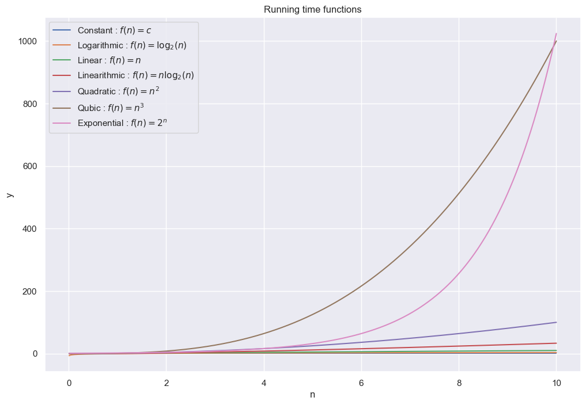
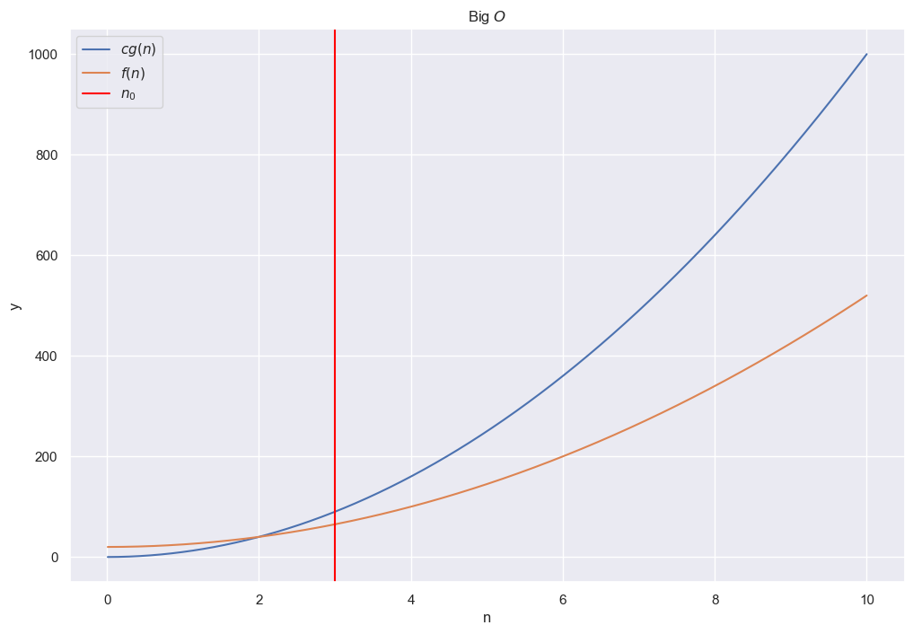
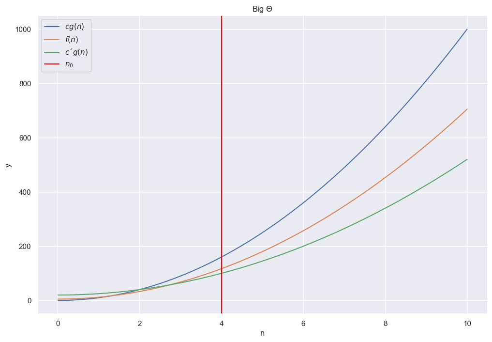

```python
import matplotlib.pyplot as plt
import seaborn as sns
import numpy as np

sns.set_theme()
```

# Running time analysis

---


```python
running_times = {'Constant': lambda n : n**0,
                 'Logarithmic': lambda n : np.log2(n),
                 'Linear': lambda n : n,
                 'Linearithmic': lambda n : n * np.log2(n),
                 'Quadratic': lambda n : n ** 2,
                 'Qubic': lambda n : n ** 3,
                 'Exponential': lambda n : 2**n}
functions = [r'$f(n) = c$', r'$f(n) = \log_2(n)$', r'$f(n) = n$', r'$f(n) = n \log_2(n)$', r'$f(n) = n^2$', r'$f(n) = n^3$', r'$f(n) = 2^n$']
```


```python
n = np.linspace(0.01, 10, 1000)
```


```python
plt.figure(figsize=(12, 8))
plt.title('Running time functions')
for fl, fs in zip(running_times.keys(), functions):
    plt.plot(n, running_times[fl](n), label=f'{fl} : {fs}')
plt.xlabel('n')
plt.ylabel('y')
plt.legend()
plt.show();
```


    

    


# Big O

---

$$
O(g(n)) = \{ f | \exists c > 0 \exists n_0 > 0 \forall n \geq n_0: f(n) \leq c g(n) \}
$$


```python
f1 = lambda n : 10 * n**2
f2 = lambda n : 5 * n**2 + 20
```


```python
plt.figure(figsize=(12, 8))
plt.title(r'Big $O$')
plt.plot(n, f1(n), label=r'$cg(n)$')
plt.plot(n, f2(n), label=r'$f(n)$')
plt.axvline(x=3, label=r'$n_0$', color='red')
plt.legend()
plt.xlabel('n')
plt.ylabel('y')
plt.show();
```


    

    


# Big $\Omega$

---

$$
\Omega(g(n)) = \{ f | \exists c > 0 \exists n_0 > 0 \forall n \geq n_0: c g(n) \leq f(n) \}
$$


```python
plt.figure(figsize=(12, 8))
plt.title(r'Big $\Omega$')
plt.plot(n, f1(n), label=r'$f(n)$')
plt.plot(n, f2(n), label=r'$cg(n)$')
plt.axvline(x=3, label=r'$n_0$', color='red')
plt.legend()
plt.xlabel('n')
plt.ylabel('y')
plt.show();
```


    

    


# Big $\Theta$

---

$$
\Theta(g(n)) = \{ f | \exists c > 0 \exists c' > 0 \exists n_0 > 0 \forall n \geq n_0: c g(n) \leq f(n) \leq c' g(n) \}
$$


```python
f3 = lambda n : 7 * n**2 + 5
```


```python
plt.figure(figsize=(12, 8))
plt.title(r'Big $\Theta$')
plt.plot(n, f1(n), label=r'$cg(n)$')
plt.plot(n, f3(n), label=r'$f(n)$')
plt.plot(n, f2(n), label=r'$c´g(n)$')
plt.axvline(x=4, label=r'$n_0$', color='red')
plt.legend()
plt.xlabel('n')
plt.ylabel('y')
plt.show();
```


    

    


# Rules

---

1. $O(1) \subset O(\log_2 n) \subset O(n) \subset O(n \log_2 n) \subset O(n^2) \subset O(n^3) \subset O(2^n)$
2. If $f_1 \in O(g_1)$ and $f_2 \in O(g_2) \Rightarrow f_1 f_2 \in O(g_1 g_2)$ 
3. If $f_1 \in O(g_1)$ and $f_2 \in O(g_2) \Rightarrow f_1 + f_2 \in O(g_1 + g_2)$ 
4. If $f_1 \in O(g_1) \Leftrightarrow g_1 \in \Omega(f_1)$
