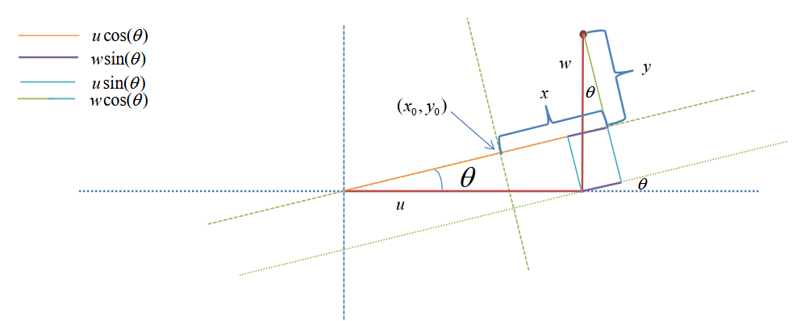

### Linear Regression discrepancy

Looking at linear regression, we want to find a linear function which fits our data. 
This is done by minimizing the squared deviation between the observed $y$ values and those predicted from the x values

$$
\triangle^2_{y} = \sum_i \left(y_i - ax_i - b \right)^2
$$

This then gives us

$$
\begin{align*}
    \frac{\partial \triangle^2_x}{\partial b} 
    &= 
    2 \sum_{i=1}^n \left( y_i - ax_i - b \right)   \\
    &= 
    2 \left(   n \bar{y} - n a \bar{x} + n b \right) \\

    &=
    0 \\
    \Rightarrow b &= \bar{y} - a \bar{x} \\
    
    \frac{\partial \triangle^2_y}{\partial a} 
    &= 
    2\sum_{i=1}^n ((y_i - \bar{y}) - a(x_i - \bar{x}))(x_i - \bar{x}) \\
    &=
    2\sum_{i=1}^n (y_i - \bar{y})(x_i - \bar{x}) - 2a\sum_{i=1}^n (x_i - \bar{x})(x_i - \bar{x}) \\
    &=
    2 V_{xy} - 2a V_{xx} \\
    &= 0 \\
    \Rightarrow a &= \frac{V_{xy}}{V_{xx}}
\end{align*}
$$

In the case of switching the axis, we get the linear function $x = \frac{y}{a} - \frac{b}{a}$ which through the minimization of the squared deviation gives the optimal values 

$$
\begin{align*}
    \frac{\partial \triangle^2_y}{\partial b} 
    &= 
    2 \sum_{i=1}^n \left( x_i - \frac{y_i}{a} + \frac{b}{a} \right) \frac{1}{a}  \\
    &= 
    2 \left( \sum_{i=1}^n  \frac{x_i}{a} - \sum_{i=1}^n \frac{y_i}{a^2} + \sum_{i=1}^n \frac{b}{a^2} \right)   \\
    &=
    2 \left(   n \frac{\bar{x}}{a} - n \frac{\bar{y}}{a^2} + n \frac{b}{a^2} \right)   \\
    &=
    0 \\
    \Rightarrow b &= \bar{y} - a \bar{x} \\
    
    \frac{\partial \triangle^2_x}{\partial a} 
    &= 
    2\sum_{i=1}^n \left( (x_i - \bar{x}) - \frac{(y_i - \bar{y}}{a} \right) \frac{(y_i - \bar{y})}{a^2} \\
    &= 
    2\sum_{i=1}^n \left( \frac{(x_i - \bar{x})(y_i - \bar{y})}{a^2} - \frac{(y_i - \bar{y}^2}{a^3} \right)  \\
    &=
    \frac{2n}{a^2} \left( V_{xy} - \frac{V_{yy}}{a} \right) \\
    &=
    0 \\
    \Rightarrow a &= \frac{V_{yy}}{V_{xy}} 
\end{align*}
$$

Which actually gives us two different values, and thus 2 completely different lines. What happens is that, when looking at the standard cartesian coordinate system, with our first regression function, we minimize the vertical squared error, thus we assume our noise is vertical, while with the second regression, we minimize the horizontal squared error, thus we assume our noise is horizontal.

When looking at errors, there exist measurement error which are caused by machines etc. Then there are also intrinsic fluctuations.

We want to find a transformation to our distribution which causes linear independance, meaning that through our transformation $ \mathbb{P}(x, y) = \mathbb{P}(x) \mathbb{P}(y) $. Here we assume that these distributions are both gaussian

$$
\mathbb{P}(x)\mathbb{P}(y) = \frac{1}{2 \pi \sigma_x \sigma_y} \exp \left( - \frac{x^2}{2 \sigma^2_x} - \frac{y^2}{2 \sigma^2_y} \right)
$$

Using the transformation $x = u cos(\theta) + w sin(\theta) - x_0$ and $y = w cos(\theta) + u sin(\theta) - y_0$

With this transformation we can transform our distributions

$$
\begin{align*}
    \sum_{i=1}^n x_i^2 &= \sum_{i=1}^n (u_i cos(\theta) + w_i sin(\theta) - x_0)^2 \\
    \sum_{i=1}^n y_i^2 &= \sum_{i=1}^n (w_i cos(\theta) + u_i sin(\theta) - y_0)^2
\end{align*}
$$

The likelihood of the data is given by 

$$
\mathbb{P}(\mathcal{D} | \theta, x_0, y_0, \sigma_x, \sigma_y)
= 
\frac{1}{(2 \pi \sigma_x \sigma_y)^2} \exp \left( - \sum_{i} \frac{x_i^2}{2 \sigma^2_x} - \sum_{i} \frac{y_i^2}{2 \sigma^2_y} \right)
$$

For the optimal values of $x_0, y_0$, we can take the derivate and set it to zero

$$
\frac{\partial}{\partial x_0} \sum_{i=1}^n x_i^2 
= 
0 
\Rightarrow 
-2 \sum_{i=1}^n (u_i cos(\theta) + w_i sin(\theta) - x_0) 
\Rightarrow 
x_0 
= 
\bar{u} cos(\theta) + \bar{w} sin(\theta) \\

\frac{\partial}{\partial y_0} \sum_{i=1}^n y_i^2 
= 
0 
\Rightarrow 
-2 \sum_{i=1}^n (w_i cos(\theta) - u_i sin(\theta) - y_0) 
\Rightarrow 
y_0 
= 
\bar{w} cos(\theta) - \bar{u} sin(\theta) \\
$$

By plugging in these values we get

$$
\begin{align*}
    \sum_{i=1}^n x_i^2 
    &= 
    \sum_{i=1}^n (u_i cos(\theta) + w_i sin(\theta) - x_0)^2 \\
    &= 
    \sum_{i=1}^n (u_i cos(\theta) + w_i sin(\theta) - \bar{u} cos(\theta) - \bar{w} sin(\theta))^2 \\
    &=
    \sum_{i=1}^n ((u_i - \bar{u})cos(\theta) + (w_i - \bar{w})sin(\theta) )^2 \\
    &=
    \sum_{i=1}^n (u_i - \bar{u})^2cos^2(\theta) + 2(u_i - \bar{u})(w_i - \bar{w}) cos(\theta) sin(\theta) + (w_i - \bar{w})^2sin^2(\theta) \\
    &=
    n V_{uu} cos^2(\theta) + 2 n V_{uw} cos(\theta) sin(\theta) + n V_{ww} sin^2(\theta) 
    
    \\
    
    \sum_{i=1}^n y_i^2 
    &= 
    \sum_{i=1}^n (w_i cos(\theta) - u_i sin(\theta) - y_0)^2 \\
    &= 
    \sum_{i=1}^n (w_i cos(\theta) - u_i sin(\theta) - \bar{w} cos(\theta) + \bar{u} sin(\theta))^2 \\
    &=
    \sum_{i=1}^n ((w_i - \bar{w})cos(\theta) + (u_i - \bar{u})sin(\theta) )^2 \\
    &=
    \sum_{i=1}^n (w_i - \bar{w})^2cos^2(\theta) + 2(u_i - \bar{u})(w_i - \bar{w}) cos(\theta) sin(\theta) + (u_i - \bar{u})^2sin^2(\theta) \\
    &=
    n V_{ww} cos^2(\theta) + 2 n V_{uw} cos(\theta) sin(\theta) + n V_{uu} sin^2(\theta)
\end{align*}
$$

Which gives us the distribution

$$
\mathbb{P}(\mathcal{D} | \theta, \sigma_x, \sigma_y) 
\propto 
\frac{1}{(2\pi \sigma_x \sigma_y)^{n - 1}} \exp \left( -n \frac{X^2}{2 \sigma_x^2} -n \frac{Y^2}{2 \sigma_y^2} \right)
$$

With

$$
X^2 = V_{uu}cos^2(\theta) + V_{ww} sin^2 (\theta) + 2 V_{uw} sin(\theta)cos(\theta) \\
Y^2 = V_{ww}cos^2(\theta) + V_{uu} sin^2 (\theta) + 2 V_{uw} sin(\theta)cos(\theta)
$$

Integrating then over the variances with the prior $ \mathbb{P}(\sigma_x) \mathbb{P}(\sigma_y) d \sigma_x d \sigma_y = \frac{d \sigma_x}{\sigma_x} \frac{d \sigma_y}{\sigma_y}$:

$$
\begin{align*}
&\Rightarrow 
\int_{0}^{\infty} \frac{1}{\sigma_x} \frac{1 }{\sigma_y} \frac{1}{(2\pi \sigma_x \sigma_y)^{n - 1}} \exp \left( -n \frac{X^2}{2 \sigma_x^2} -n \frac{Y^2}{2 \sigma_y^2} \right) d \sigma_x d \sigma_y \\
& \propto 
\left[ \int_{0}^{\infty} \frac{1}{\sigma_x^n} \exp \left( -n \frac{X^2}{2 \sigma_x^2} \right) d \sigma_x \right] 
\left[ \int_{0}^{\infty} \frac{1}{\sigma_y^n} \exp \left( -n \frac{y^2}{2 \sigma_y^2} \right) d \sigma_y \right] \\
& \propto
\frac{1}{[X^2]^{\frac{n-1}{2}}} \frac{1}{[Y^2]^{\frac{n-1}{2}}} \\
\Rightarrow \mathbb{P}(\mathcal{D} | \theta) &= [X^2 Y^2]^{-\frac{n - 1}{2}} 
\end{align*}
$$

Setting then our slope line as $\alpha = tan(\theta)$ we get 

$$
\begin{align*}
X^2 
&= 
V_{uu}cos^2(\theta) + V_{ww} sin^2 (\theta) + 2 V_{uw} sin(\theta)cos(\theta) \\
&= 
cos^2(\theta) \left( V_{uu} + V_{ww} \frac{sin^2 (\theta)}{cos^2(\theta)} + 2 V_{uw} \frac{sin(\theta)}{cos(\theta)} \right) \\
&=
cos^2(\theta) \left( V_{uu} + V_{ww} tan^2(\theta) + 2 V_{uw} tan(\theta) \right) \\
&=
\frac{1}{1 + tan^2(\theta)} \left( V_{uu} + V_{ww} \alpha^2 + 2 V_{uw} \alpha \right) \\
&=
\frac{V_{uu} + V_{ww} \alpha^2 + 2 V_{uw} \alpha}{1 + \alpha^2} \\

Y^2 &= \frac{V_{ww} + V_{uu} \alpha^2 - 2V_{uw}\alpha}{1 + \alpha^2}
\end{align*}
$$

Which in the end gives us the likelihood

$$
\mathbb{P}(\mathcal{D} | \alpha) = \left[ \frac{(1 + \alpha^2)^2}{(V_{uu} + V_{ww} \alpha^2 + 2 V_{uw} \alpha)(V_{ww} + V_{uu} \alpha^2 - 2V_{uw}\alpha)} \right]^{\frac{n-1}{2}}
$$

The optimal values of $\alpha$ are then

$$
\alpha^* = \frac{V_{uu} - V_{ww}}{2 V_{uw}} \pm \sqrt{1 + \left( \frac{V_{uu} - V_{ww}}{2V_{uw}} \right)^2 }
$$

### Vector notation

We can also express our transformation in $u$ and $w$ in terms of vector and matrices

$$
\mathbf{x} = \begin{pmatrix} x \\ y \end{pmatrix}, \quad 
\mathbf{\nu} = \begin{pmatrix} u - \bar{u} \\ w - \bar{w} \end{pmatrix}, \quad 
R = \begin{pmatrix} cos(\theta) & sin(\theta) \\ -sin(\theta) & cos(\theta) \end{pmatrix} \\
\Rightarrow \mathbf{x} = R \mathbf{\nu}
$$

Our likelihood in the form of the multivariate gaussian is given by

$$
\mathbb{P}(\mathbf{x} | \mathbf{\sigma}) = \frac{1}{2 \pi \sigma_x \sigma_y} \exp \left(- \frac{1}{2} \mathbf{x}^T D \mathbf{x} \right)
$$

where $D_{ij} = \frac{\delta_{ij}}{\sigma^2_{ij}}$. Applying our transformation we get and defining $R^T D R = M$

$$
\mathbb{P}(\mathbf{\nu} | \mathbf{\sigma}) = \frac{1}{2 \pi \sigma_x \sigma_y} \exp \left( - \frac{1}{2} \mathbf{\nu}^T R^T D R \mathbf{\nu} \right)
=
\frac{1}{2 \pi \sigma_x \sigma_y} \exp \left( - \frac{1}{2} \mathbf{\nu}^T M \mathbf{\nu} \right)
$$

The general form of a 2 dimensional gaussian is given by

$$
\mathbb{P}(\mathbf{\nu} | \mathbf{\sigma}, \mathbf{\mu}) 
= 
\frac{1}{2 \pi \sigma_x \sigma_y} \exp \left( - \frac{1}{2} (\mathbf{\nu} - \mathbf{\mu})^T M (\mathbf{\nu} - \mathbf{\mu}) \right)
$$

Thus the natural coordinate system, is the one that diagonalizes matrix M $M = R^{-1} D R$. 
Otherwise said, the columns in $R$ contain the eigenvectors of M. 
We can write any vector $\mathbf{\nu}$ as a linear combination of the eigenvectors $ \mathbf{\nu} = x \mathbf{\nu}_1 + y \mathbf{\nu}_2$. With the assumption that our eigenvectors are normalised i.e. $ ||\mathbf{\nu}|| = 1$ and that two eigenvectors which form a basis are orthogonal to eachother $\mathbf{\nu}_1^T \mathbf{\nu}_2 = 0$ we get:

$$
\begin{align*}
    \mathbf{\nu}^T M \mathbf{\nu} 
    &= 
    (x \mathbf{\nu}_1 + y \mathbf{\nu}_2)^T( \lambda_1 x \mathbf{\nu}_1 + \lambda_2 y \mathbf{\nu}_2) \\
    &=
    (x \mathbf{\nu}_1^T + y \mathbf{\nu}_2^T)( \lambda_1 x \mathbf{\nu}_1 + \lambda_2 y \mathbf{\nu}_2) \\
    &= 
    x^2 \mathbf{\nu}_1^T \lambda_1 \mathbf{\nu}_1 + x \mathbf{\nu}_1^T \lambda_2 y \mathbf{\nu}_2 + y \mathbf{\nu}_2^T \lambda_1 x \mathbf{\nu}_1 + y^2 \mathbf{\nu}_2^T \lambda_2 \mathbf{\nu}_2 \\
    &=
    x^2 \mathbf{\nu}_1^T \lambda_1 \mathbf{\nu}_1 +  xy (\mathbf{\nu}_1^T \lambda_2 \mathbf{\nu}_2 + \mathbf{\nu}_2^T \lambda_1 \mathbf{\nu}_1)  + y^2 \mathbf{\nu}_2^T \lambda_2 \mathbf{\nu}_2 \\
    &=
    x^2 \lambda_1 + y^2  \lambda_2 \\
\end{align*}
$$

 But now comparing our gaussians we have that $ -\frac{1}{2} \left( \frac{x^2}{\sigma_x^2} + \frac{y^2}{\sigma_y^2} \right) \overset{!}{=} - \frac{1}{2} \mathbf{\nu}^T M \mathbf{\nu} = - \frac{1}{2} \left( \lambda_1 x^2 + \lambda_2 y^2 \right) $, which gives us that $\lambda_1 = \frac{1}{\sigma_x^2}$ and $\lambda_2 = \frac{1}{\sigma_y^2}$. 
 Thus the independent directions for a 2d-Gaussian is given by the eigenvectors of $M$ and the eigenvalues are the inverse variances along the natural direction.
 The Covariance matrix, where $V_{ij}$ is the variance between $i$ and $j$ is defined as:
 
$$
C = \begin{pmatrix} V_{uu} & V_{uw} \\ V_{uw} & V_{ww} \end{pmatrix}
$$

We know that $ \mathbf{x} = R (\mathbf{\nu} - \mathbf{\mu}) \Leftrightarrow \nu_i - \mu_i = \sum_{k} R^{-1}_{ik} x_k $. 
Because then 

$$
\begin{align*}
    V_{ij} 
    &= 
    \mathbb{E}\left[ (\nu_i - \mu_i)(\nu_j - \mu_j) \right]  \\
    &= 
    \mathbb{E}\left[ \left( \sum_{k} R^{-1}_{ik} x_k \right) \left( \sum_{l} R^{-1}_{jl} x_l \right) \right] \\
    &=
    \mathbb{E}\left[ \left( \sum_{k} \sum_{l} R^{-1}_{ik} R^{-1}_{jl} x_k x_l \right) \right] \\
    &=
    \sum_{k} \sum_{l} R^{-1}_{ik} R^{-1}_{jl} \mathbb{E}\left[  x_k x_l \right] \\
    &=
    \sum_{k} R^{-1}_{ik} \sigma_k^2 R_{kj} \\
    &=
    (R^{-1} D^{-1} R)_{ij}

\end{align*}
$$

Which then means that $C = M^{-1}$.
Because then if the best line is an eigenvector of M it is also an eigenvector of C. 
Thus we want to check that the line 

$$
\begin{pmatrix} u - \bar{u} \\ w - \bar{w} \end{pmatrix}
\propto
\begin{pmatrix} 1 \\ alpha \end{pmatrix}
$$

is an eigenvector of C.

$$
C \begin{pmatrix} 1 \\ \alpha \end{pmatrix} = \lambda \begin{pmatrix} 1 \\ \alpha \end{pmatrix}
\Rightarrow 
\begin{cases}
    V_{uu} + \alpha V_{uw} = \lambda \\
    V_{uw} + \alpha V_{ww} = \lambda \alpha
\end{cases} 
$$

$$
\begin{align*}
    & \Rightarrow V_{uw} + \alpha V_{ww} = \alpha (V_{uu} + \alpha V_{uw}) \\
    & \Leftrightarrow \alpha^2 V_{uw} + \alpha (V_{ww} - V_{uu}) + V_{uw} \overset{!}{=} 0 \\
    & \Rightarrow \frac{ (V_{ww} - V_{uu}) \pm \sqrt{(V_{uu} - V_{ww})^2 + 4 V_{uw}^2} }{2V_{uw}}
    & \Rightarrow \frac{ (V_{ww} - V_{uu})}{2V_{uw}} \pm \sqrt{ 1 + \left( \frac{V_{uu} - V_{ww}}{2 V_{uw}} \right)^2 }
\end{align*}
$$

Thus our optimal line is given by an eigenvector of the covariance matrix. 
This eigenvector corresponds to the largest eigenvalue, along which the data varies the most. 
This isn't dependend on the amount of dimensions.

The normalization constant of a multivariate gaussian is the square root of determinant of the Covariance matrix, i.e. $ \frac{1}{\sqrt{|C|}}$.
Looking at how likely is is that there is dependence at all, no dependene occurs at $\alpha = 0$. 
We can thus calculate to what extent the posterior $ \mathbb{P}(\alpha | \mathcal{D})$ overlaps $\alpha=0$.
$ \mathbb{P}( \mathcal{D} | \alpha) = \left[ V_{uu} V_{ww} \right]^{-\frac{n-1}{2}}$. For $ \mathbb{P}(\mathcal{D} | \alpha_*)$ we note that $X^2 = \frac{1}{n} \sum_{i} (x_i - \bar{x})^2$ and $Y^2 = \frac{1}{n} \sum_{i} (y_i - \bar{y})^2$, which means that $X^2Y^2 = V_{xx}^2 V_{yy}^2$, (???) which is the determinant of the covariance matrix in the normal system. 
Because the Covariance is invariant to rotation we get 

$$
det(V) = \begin{vmatrix} V_{uu} & V_{uw} \\ V_{uw} & V_{ww} \end{vmatrix} = V_{uu} V_{ww} - V_{uw}^2
$$ 

Which then gives us the ratioof likelihoods

$$
\frac{ \mathbb{P}(\mathcal{D} | \alpha_*)}{\mathcal{D} | 0)} 
= 
\left( \frac{V_{uu} V_{ww} - V_{uw}^2}{V_{uu}V_{ww}} \right)^{- \frac{n-1}{2}} 
= 
\left( 1 - \frac{V_{uw}^2}{V_{uu}V_{ww}} \right)^{- \frac{n-1}{2}} 
$$

This second term is called the pearson correlation-coefficient that measures the strength and direction of the relationship between two variables. -1 means negative correlation, 0 means no correlation and 1 means positive correlation. ($V_{xx}V_{yy}) = V_{uu}V_{ww} (1 - r^2)$)

### Principle Component Analysis (PCA)

By shifting and rotating in the dimensions of a distribution, we can make the basis become independent of eachother. Thus given a coordinate system $ \mathbf{x} = (x_1, x_2, ..., x_d)$ there exist some coordinate system $ \mathbf{y} = (y_1, y_2, ..., y_d)$ where the data are independently Gaussian distributed along each of the axis. Thus there exist a rotation matrix which connects the two coordinate systems 

$$
\mathbf{y} - \bar{ \mathbf{y}} = \mathbf{R} (\mathbf{x} - \bar{\mathbf{x}})
$$

Thus with 

$$ 
\begin{align*}
    \mathbb{P}(\mathbf{y}) 
    \propto 
    \exp \left( - \sum_{i=1}^d \frac{(y_i - \bar{y}_i)^2}{2 \sigma_i^2} \right) 
    & \propto
    -\frac{1}{2} (\mathbf{y} - \bar{\mathbf{y}})^T \Lambda (\mathbf{y} - \bar{\mathbf{y}}) \\
    & \propto
    -\frac{1}{2} (\mathbf{x} - \bar{\mathbf{x}})^T \mathbf{R}^{-1} \Lambda \mathbf{R} (\mathbf{x} - \bar{\mathbf{x}}) \\
    \Rightarrow 
    \mathbb{P}(\mathbf{x}) 
    \propto    
    \exp \left( -\frac{1}{2} (\mathbf{x} - \bar{\mathbf{x}})^T \mathbf{R}^{-1} \Lambda \mathbf{R} (\mathbf{x} - \bar{\mathbf{x}}) \right)
    
\end{align*}
$$

Here again $M = \mathbf{R}^{-1} \Lambda \mathbf{R}$ and then $C = M^{-1} = \mathbf{R}^{-1} \Lambda^{-1} \mathbf{R}$.
The eigenvectors of $C$ specifiy the natural coordinate system, in which there are no dependecies between the fluctuations along each coordinate system.
Thus we are able to approximate our data with Gaussians in lower dimensions, by using only the first few dimensions $k$, meaning the first $k$ eigenvectors.
