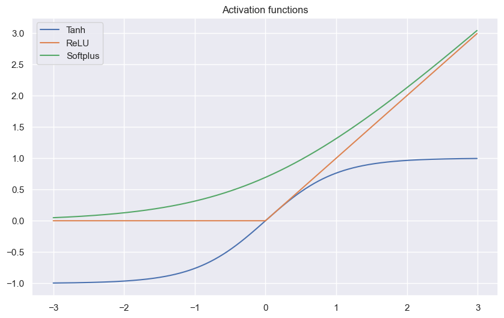
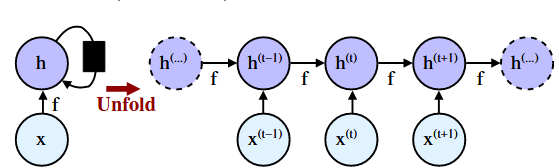
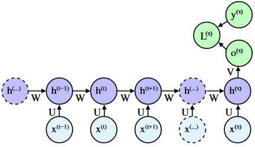
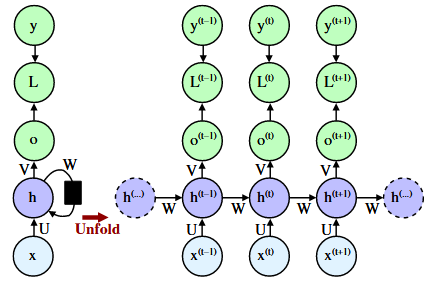
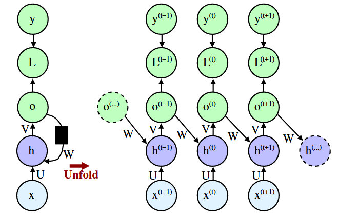
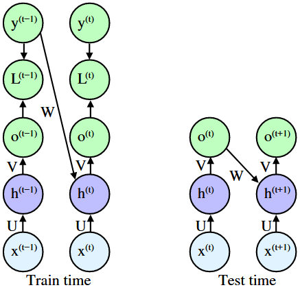
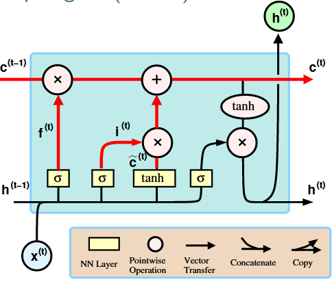

```python
import numpy as np
import matplotlib.pyplot as plt
import seaborn as sns

sns.set_theme()
```

# Linear Classifier (Feed forward NN)

We can understand a simple linear classifier as a weighted sum of the data points

$$
\hat{c} = \text{sign} (\mathbf{w}^T \mathbf{x})
$$

By the use of basis functions (basis expansion) we can have a more refined prediction. These basis functions themselfes can be learned in Neural networks

$$
f( \mathbf{w}^T \phi(\mathbf{x}))
$$

A neural network consists uf many such linear functions, creating a multilayer network. The neural network is made up of so called neurons. 
Each neuron calculates the product of the weights and the input data $ \mathbf{x} $., i.e. each neuron calculates $y_i = f(\mathbf{w_i} ^T \mathbf{x}$), where then $f(\cdot)$ is the so called activation function. For the output, the last hidden layer vector $ \mathbf{y}$ is again weighted by a vector to yield a single value output 

$$
\hat{c} = f(\mathbf{w_j}^T \mathbf{y})
$$

## Activation functions

The classic activation functions are often bounded such that they have a lower and upper bound. More modern activation functions are unbounded


```python
x = np.arange(-3, 3, 0.01)

tanh = (np.exp(x) - np.exp(-x)) / (np.exp(x) + np.exp(-x))
relu = [x_i if x_i > 0 else 0 for x_i in x]
softplus = np.log(1 + np.exp(x))

plt.figure(figsize=(10, 6))

plt.title('Activation functions')
plt.plot(x, tanh, label='Tanh')
plt.plot(x, relu, label='ReLU')
plt.plot(x, softplus, label='Softplus')
plt.legend()
plt.show()
```


    

    


## Convolution

Convolution is often used for image neural networks and it works by passing a kernel (filter) of weights over an image which then calculates the sum of the pixel values.
 Our input may have multiple layers which we would like to combine, for this we use a convolutional layer, which passes different filters over the different layers of the input and combines the weighted sum of all the layers to create a single layer.


## Pooling

We can then pool the output of the convolution. 
The exist different pooling methods. We again pass a kernel (filter) over the output and iniside this grid, we can perform different functions, often used pooling methods are 

1. Average pooling: Taking the average inside the kernel
2. Max pooling: Taking the maximum value inside the kernel

Both pooling and convolution causes a reduction in the number of inputs to the next layer.

## Residual connection

The residual connections is an additional link that connects some layers in a neural network that are not directly adjacent. 
The usage of them may help with floating point errors for deep networks.
Often large and deep networks suffer from exploding gradients or vanishing gradients, the usage thus of residual connections has been shown to aid in preventing these kinds of errors.

## Dropout 

Dropout refers the the dropping out of the nodes in a neural network. At each iteration a node is dropped out with a certain probability. 
Dropout layers often help with preventing of overfitting. In overfitting, a unit may change in a way that fixes up the mistakes of the other units. This leads to complex co-adaptations, which in turn leads to the overfitting problem because this complex co-adaptation fails to generalise on the unseen dataset.

Now, if we use dropout, it prevents these units to fix up the mistake of other units, thus preventing co-adaptation, as in every iteration the presence of a unit is highly unreliable. So by randomly dropping a few units (nodes), it forces the layers to take more or less responsibility for the input by taking a probabilistic approach.

# Backpropagation

Imagine we have a NN with our input vector $ \mathbf{x}$, a hidden layer where each neuron ($w_{ji}$) gives the output $y_i$ and then an output layer ($w_
{kj}$) which gives us the output $z_i$, which we then compare to our target values $t_i$.
We use the mean squared training error $ J(\mathbf{w}) = \frac{1}{2n} \sum_{l=1}^n || \mathbf{t}_l - \mathbf{z}_l (\mathbf{w})||^2 $ for training and we would now like to adjust our parameters by using gradient descent. Because $ \mathbf{z}_l(\mathbf{w}) = \phi(net_l) = \phi (\mathbf{w}_l^T \mathbf{y})$. Here $k$ denotes the $k$-th layer (last layer here) and $j$ is the $j$-th component of the $k$-th weights.

$$
\mathbf{w} \leftarrow \mathbf{w} + \triangle \mathbf{w}, \quad \triangle \mathbf{w} = - \eta \frac{\partial J}{\partial \mathbf{w}} 
$$

For our hidden to output units we get 

$$
\frac{\partial J}{\partial w_{kj}})
= 
\frac{\partial J}{\partial z_k} \frac{\partial z_k}{\partial w_{kj}} 
=
\frac{\partial J}{\partial z_k} \frac{\partial z_k}{net_k}  \frac{\partial net_k}{\partial w_{kj}} 
= 
\frac{\partial J}{\partial z_k} \frac{\partial z_k}{net_k} \frac{\partial \mathbf{w}_k^T \mathbf{y}}{\partial w_{kj}} 
= 
\frac{\partial J}{\partial z_k} \frac{\partial z_k}{net_k} y_j 
=
\delta_k y_j
$$

The sensitivity $\delta_k$ describes how the overall error changes with the unit's net acvtivation.

$$
\delta_k 
= 
\frac{\partial J}{\partial z_k} \frac{\partial z_k}{net_k} 
= 
\left( \frac{\partial }{\partial z_k} \frac{1}{2}(t_k - z_k)^2 \right) \left( \frac{\partial  }{\partial net_k} \phi(net_k) \right)
= - (t_k - z_k) \phi'(net_k)
$$

Thus we get the gradient step

$$
\triangle w_{kj} = -\eta \frac{\partial J}{\partial w_{kj}} = - \eta \delta_k \delta_k y_j = \eta (t_k - z_k) \phi'(net_k) y_j
$$

For our input to hidden units we have that

$$
y_j = \phi(net_j) = \phi(\mathbf{w}^T_j \mathbf{x})
$$

thus the gradient for our hidden neurons is the same but looking now at the  $ \mathbf{w}_{ji}$ component of the $j$-th weights.

$$
\frac{\partial J}{\partial w_{ji}} 
= 
\frac{\partial J}{\partial y_j} \frac{\partial y_j}{\partial w_{ji}} 
=
\frac{\partial J}{\partial y_j} \frac{\partial y_j}{\partial net_j} \frac{\partial net_j}{\partial w_{ji}} 
=
\frac{\partial J}{\partial y_j} \frac{\partial y_j}{\partial net_j} \frac{\partial \mathbf{w}_j^T \mathbf{x}}{\partial w_{ji}} 
=
\frac{\partial J}{\partial y_j} \frac{\partial y_j}{\partial net_j} x_i
=
\delta_j x_i
$$

Because for $ \mathbf{z}_l(\mathbf{w}) = \phi(net_l) = \phi (\mathbf{w}_l^T \mathbf{y}) = \phi \left( \sum_{i=1}^d w_{li} \sum_{k=1}^c \mathbf{w}_{k} \mathbf{x} \right)$

$$
\delta_j 
= 
\frac{\partial J}{\partial y_j} \frac{\partial y_j}{\partial net_j} 
= 
\left( \sum_{k=1}^c \frac{\partial J }{\partial net_k} \frac{\partial net_k }{\partial y_j} \right) \left( \frac{\partial }{\partial net_j} \phi(net_j) \right)
=
\phi'(net_j) \sum_{k=1}^c \delta_k w_{kj} 
$$

Thus the sensitivity of the hidden unit is proportional to the weighted sum of sensitivities at the ouput units. It then follows that the output sensitivities are propogated back to the hidden units. 
For our gradient step we then get

$$
\triangle w_{ji} = - \eta \frac{\partial J}{\partial w_{ji}} = -\eta \delta_j x_i = -\eta \phi'(net_j) x_i \sum_{k=1}^c \delta_k w_{kj}
$$

## Stochastic Backpropagation

In stochastic Backpropagation, we update our weights $ \mathbf{w}$ by using only a randomly subsample set of our data.

1. Choose $ \mathbf{x}^m $ at random (m-iteration
2. $w_{kj} \leftarrow w_{kj} - \eta \delta^m_k y_j^m$
3. $w_{jj} \leftarrow w_{jj} - \eta \delta^m_j x_i^m$
4. $m \leftarrow m + 1$

until $||\nabla J(\mathbf{w})|| < \epsilon $.


# Expressive Power of Networks

Looking now at the capabilities of NN, we may ask what is needed to be able to make decisions, predictions etc. 
In escence, a three layer NN is able to make every decision.
If the input-output relation is continuous, and if there are sufficiently many hidden units.

1. **Superposition Theorem**

*Every continuous function $f(x)$ on the hypercube $I^d (I = [0, 1], d \geq 2)$ can be represented in the form*

$$
f(x) = \sum_{j=1}^{2d + 1} \Phi \left( \sum_{i=1}^d \psi_{ji} (x_i)  \right)
$$

*for properly chosen $\Phi : \mathbb{R} \rightarrow \mathbb{R}, \psi_{ji}:[0, 1] \rightarrow \mathbb{R}$.*
Thus any multivariate function continuous function can be represented as a superposition of one-dimensional functions.
For our NN this means that each of the $2d + 1$ hidden unit takes as input a sum of $d$ nonlinear functions, $\sum_{i=1}^d \psi_{ji} (x_i)$, on for each input feature $x_i$.
Each hidden unit then emits a non linear function $\Phi(\cdot)$ of its total input. 
The ouput unit then emits the sum of all contributions of the hidden units.

The problem with this theorem for our NN is that the functions $\Phi$ and $\psi_{ji}$ only exist bny the theorem, but may be hard to find maybe even impossible.

2. **Weierstrass Approximation Theorem**

*Suppose $f$ is a continuous real-valued function defined on the real interval $[a, b]$, i.e. $f \in C([a, b])$. 
For every $\epsilon > 0$, there exists a polynomial $p$ such that $||f - p||_{\infty, [a, b]} < \epsilon$.*

Thus any real valued continous function on a defined interval can be uniformly approximated by a polynomial function.  
Polynomial functions are thus dense in $C([a, b])$.

Using so called ridge functions $f( \mathbf{x}) : \mathbb{R}^n \rightarrow \mathbb{R}$, or $f(\mathbf{x}) = \phi(\mathbf{w}^T \mathbf{x} + b)$. 
They are differentiable at $z = \mathbf{w}^T \mathbf{x} + b$:
 
$$
\Rightarrow \nabla_{\mathbf{x}} f(\mathbf{x}) = \phi'(z) \nabla_{\mathbf{x}}(\mathbf{w}^T \mathbf{x} + b) = \phi'(z) \mathbf{w}
$$

The gradient descent is therefor simple to calculate and is just defined by the direction of the linear part. Because now the polynomials can be represented arbitrarily well by combinations of ridge functions, it follows that the ridge functions are also dense in $C([0, 1])$. By ***Dimension lifting***, density on the unit interval implies density on the hypercube. Thus the superposition of ridge functions creates a dense hypercube space.

3. **Universal approximations by ridge functions Theorem**

*Let $\phi(\cdot)$ be a non-constant, bounded, and monotonically-increasing continuous function. 
Let $I^d$ denote the unit hypercube $[0, 1]^d$, and $C(I^d)$ the space of continuous functions on $I^d$. 
Then, given any $\epsilon > 0$ and any function $f \in C(I^d)$, there exist an integer $N$, real constants $b_i, b_i \in \mathbb{R}$ and real vectors $ \mathbf{w}_i \in \mathbb{R}^d, i=1, ..., N$, such that we may define*

$$
F(x) = \sum_{i=1}^N v_i \phi(\mathbf{w}_i^T \mathbf{x} + b_i)
$$

*as an approximate realization of the function $f$, i.e. $||F - f||_{\infty, I^d} < \epsilon $*.

Thus functions of the form $F(x)$ are dense in the space $C(I^d)$. This also still holds when replacing $I^d$ with any compact subset of $ \mathbb{R}^d$.

## Rectifiers

In practice often more simple functions like rectifiers are used as an activation function. A rectifier function is 

$$
f(x) = x^+ = \max(0, x)
$$

Where $x$ is the input to a neuron. A unit employing the rectifier is called rectified linear unit (RelU).

4. **Universal Approximation by ReLU networks Theorem**

*Any function $f \in C([0, 1])$ can be uniformly approximated to arbitrary precision by a polygonal line. A polygonal line on $[0, 1]$ with $m$ pieces can be written as* 

$$
g(x) = ax + b + \sum_{i=1}^{m - 1} c_i(x - x_i)_+ 
$$

*with knots $0 = x_0 < x_1 < \cdot \cdot \cdot < x_{m-1} < x_m = 1 $ and $m + 1$ parameters $a, b, c_i \in \mathbb{R}$. Thus networks with one (wide enough) hidden layer of ReLU are universal approximators for continuous functions.*

By these theorem we can theoretically approximate any continuous function through simple functions like ReLU's. Why would we then use more hidden layers?
We want to characterize the expressive power by counting into how many cells we can partition $ \mathbb{R}^d $ (input space) with combinations of rectifying units. A rectifier is a piecewise linear function and partitions $ \mathbb{R}^d$ into two open half spaces 

$$
H^+ = \mathbf{x} : \mathbf{w}^T \mathbf{x} + b > 0 \in \mathbb{R}^d \\
H^- = \mathbf{x} : \mathbf{w}^T \mathbf{x} + b < 0 \in \mathbb{R}^d
$$

Thus the space $ \mathbb{R}^d$ is split into two regions by the hyperplane $H^0 = \mathbf{x} : \mathbf{w}^T \mathbf{x} + b = 0 \in \mathbb{R}^d$. 
Thus 2 ReLU functions can partition the space into 4 etc. 

5. **Region partition Theorem**

*An arrangement of $m$ hyperplanes in $ \mathbb{R}^n$ has at most $\sum_{i = 0}^n \begin{pmatrix} m \\ i \end{pmatrix}$ regions*
 
6. **ReLU partition Theorem**

*A rectifier neural network with $d$ input units and $L$ hidden layers of width $m \geq d$ can compute functions that have $\Omega \left( \left( \frac{m}{d}\right)^{(L-1)d} m^d \right)$ linear regions.*

The number of linear regions we can partition our input space into grows exponentially in $L$ and only polynomial in $m$. 
Thus using more hidden layers achieves a larger partition of our input space then using more neurons in a 3 layer network.
More hidden layers thus allows for more expressiveness of the input.

# Reccurent Neural Networks (RNN)

We use a computational graph, i.e. a directed graph where the nodes correspond to operations or variables to define our RNN. RNN are often used for dynamical systems where the state $\mathbf{s}^t$ depends on the previous state $\mathbf{s}^{t -1}$ which is updated through some function $f$ which depends on the parameters $ \mathbf{\theta} $. 

$$
\mathbf{s}^t = f(\mathbf{s}^{t - 1}; \mathbf{\theta})
$$

Often, a dynamical system is driven by an external signal 

$$
\mathbf{s}^t = f(\mathbf{s}^{t - 1}, \mathbf{x}^t; \mathbf{\theta})
$$

 <br>


The state of the dynamical system is often the hidden unit of our NN, i.e. $ \mathbf{s}^t = \mathbf{h}^t$, such that $ \mathbf{h}^t = f(\mathbf{h}^{t - 1}, \mathbf{x}^t; \mathbf{\theta})$. 
Often these networks learn for a fixed timeframe $[0, \tau]$ where at $ \mathbf{h}^{\tau}$ we compare the output with a loss function to the true label. 
During the processing of $ \mathbf{h}$ at different time frames. 
We transform our state by a weight matrix $W$ which transforms the values of the state and at each time point add new information $ \mathbf{x}^t$ which is also transformed by a weigh matrix $U$.
Because $ \mathbf{h}$ has a fixed length, we cannot store all the information in this vector, therefor it only represents a lossy summary (compressed version) of the task relevent aspects $ \mathbf{x}^{1:t}$. 
By minimizing the loss we then only focus on the relevant aspects for predicting the target. 
We can represent the state $ \mathbf{h}^t$ as a function $g^t$ which takes the whole past sequence as input. 
We can factorize $g^t$ into repeated application of the function $f$.
In our model $ \mathbf{h}$ aswell as $W$ and $U$ have fixed sizes, and we use the same function $f$ for each transition (parameter sharing). 
Because we use the same function at each step, we can generalise our model to arbitrarily large input sequences, also sequences not observed in the training data.
The parameter sharing also reduces the number of degrees of freedom in our model, which allows for fewer training examples $\rightarrow$ less parameters need to be trained.
Drawback of this version of the RNN is that an output is only given after having seen the whole input sequence. 
We can change this by generating an output at each state $ \mathbf{h}^t$.



Every hidden unit now produces it's own output where the matrix $V$ transforms the state into a single valued output and these outputs are then compared to target that time step via a loss function.
Generally the components of the RNN look like

1. $ \mathbf{a}^t = \mathbf{b} + W \mathbf{h}^{t-1} + U \mathbf{x}^t$
2. $ \mathbf{h}^t = \phi(\mathbf{a}^t)$
3. $ \mathbf{o}^t = c + V \mathbf{h}^t$
4. $\hat{\mathbf{y}}^t = \text{softmax}(\mathbf{o}^t)$

The RNN here maps the input sequence to an output sequence of the same length. 
The total loss of the system is then the sum of the losses over all times $t_i$.
Calculating the gradient becomes expensive as we need a forward pass through the whole network for our input sequence to calculate all variables and then need to backproporgate our gradient at each time step $t_i$ (Back propagation through time (BPTT)).
Because then each time step depends on the previous, our runnint time $O(\tau)$ cannot be reduced by parallelization.
We can simplify our RNN by having our hidden state at $ \mathbf{h}^t$ not directly on the hidden state $ \mathbf{h}^{t-1}$ but on the output $ \mathbf{o}^{t-1}$.



The problem with this is that our hidden state is much more expressive then the output value. 
An advantage on the other hand is that for any loss function at time step $t$ because all time steps are decoupled, training can be parallelized. 
The gradient at step $t$ can be computed now in isolation. 
Because then now our training set provides the ideal output of our systems we can instead of using our output use the target variables as input for our new state, this is called ***Teacher forcing***.
This setup then allows us to calculate each state separate and thus parallel.



## Sequence to sequence

If now our input length differs from our output length such as with machine translation etc.
For this we use an RNN where the input is called the context. We then want to produce a representation of this context $C$, a vector which summarizes the input sequence $X = (x^1, ..., x^{n_x})$.
We use thus an encoded which encodes our sequence into a context variable which summarizes the input, which is then fed into a second RNN called the decoder wich generates the output sequence $Y = (y^1, ..., y^{n_y})$.
Here then the two RNNs are trained jointly to maximize the average $\log \mathbb{P}(Y | X)$ over all the pairs of $x$ and $y$ sequences in the training set.

## Long Short-term memory (LSTM) cells

Eventhough RNNs can keep track of arbitrary long-term dependecies, the problem often lies that we can only compute with a finite precision which causes Gradients to vanish or explode. 
Using a LSTM unit partially solves this problem, because LSTMs allow gradients to flow unchanged.
A standard LSTM consists of

1. Cell
2. Three regulators / gates
3. Input: Controls to which extent a new value flows into the cell
4. Output: Controls to which extent a value remains in the cell.
5. Forget gate: Controls to which extens the currecnt value is used to compute the output activation


The blue box defines the RNN cell. 

## Cell state
The top line, the so called cell state $ \mathbf{c}^{t}$, allows the flow of unchanged information through the network and helps with the preservation of context when learning long-term dependecies.

## Forget Gate
The forget gate alters the state of the cell based on the current input $ \mathbf{x}^t$ and the output $ \mathbf{h}^{t-1}$ of the previous cell. This layer basically decides what information we're going to throw away from the cell state.

$$
f^t = \sigma(W^f [\mathbf{h}^{t-1}, \mathbf{x}^t] + \mathbf{b}^f)
$$


## Input Gate
The input gate decides and computes values to be updated in the state cell

$$
\mathbf{i}^t =  \sigma(W^i [\mathbf{h}^{t-1}, \mathbf{x}^t] + \mathbf{b}^i) \\
\tilde{\mathbf{c}}^t =  \tanh(W^c [\mathbf{h}^{t-1}, \mathbf{x}^t] + \mathbf{b}^c)
$$


Then together with the forget gate these two gates update the old cell state

$$
\mathbf{c}^t = \mathbf{f}^t \circ \mathbf{c}^{t-1} + \mathbf{i}^t \circ  \tilde{\mathbf{c}}^t
$$



## Output gate

The output gate then computes the output from the cell state ($\mathbf{h}^t$)which is then sent to the next cell.

$$
\mathbf{o}^t = \sigma(W^o [\mathbf{h}^{t-1}, \mathbf{x}^t] + \mathbf{b}^o) \\
\mathbf{h}^t = tanh(\mathbf{c}^t) \circ \mathbf{o}^t
$$


## Bidirectional LSTM

Bi-LSTM (Bidirectional Long Short-Term Memory) is a type of recurrent neural network (RNN) that processes sequential data in both forward and backward directions. 
It combines the power of LSTM with bidirectional processing, allowing the model to capture both past and future context of the input sequence. 
It consists of two LSTM layers: one processing the sequence in the forward direction and the other in the backward direction. Each layer maintains its own hidden states and memory cells.

## Word embeddings

To have words as inputs for our RNNs we need a representation of a word in a sentence. This encoding often happens through encoders and decoders which learn the context of words or by use of vector representation where a word is represented as a vector in a multidimensional space.

# Language models

A simple language model may consists of a 

1. Input layer
2. Word embedding: A encoder for context specific representation of words
3. Hidden layer: enables flexible, non-linear mappings
4. Output layer: Predicts Probability for next word.

This implementation overcomes the sparsity problem where specific sentences don't often appear in training data. We only need small window of context to predict next word.
Problems with this model is that the fixed window is often to small, i.e. we want more context of the surrounding words. 
The window is then never large enough. 
There is also no symmetrie in this model, different inputs are multiplied by completely different weights and it doesn't allow for arbitraty input length.

Using instead an RNN with the same layer structure as before allows us to handle input lengths of arbitrary size. 
Context is kept through the states, the model doesn't increase in size for longer inputs, and the same weights are applied at each step (Symmetrie in how inputs are processed).
The disadvantages are that the recurrent computation is slow (BPTT) and information loss (Vanishing gradient -> LSTM).

The training of such models is done by getting a large amount of text and at every step try to predict the next word and compare it to the actual word by a loss function which is minimized during training.
Generating new text is then done by giving a start word and use the output for the next input and so on.

## Evaluating Language models

The standard evaluation metric for Language models is perplexity. The preplexity is basically a measure of the degree of uncertainty of a LM when it generates a new word.
A lower perplexity therefor means a lower uncertainty.

$$
\text{perplexity} = \prod_{t=1}^T \left(\frac{1}{P_{LM}(\mathbf{x}^{t+1} | \mathbf{x}^t, ..., \mathbf{x}^1)} \right)^{1 / T}
$$

The inverse probability is the probability of a sentence, T is the number of words. 

# Interpretability in deep learning models

In general NN are hard to interpret.
A question then may be, can we optimise a NN to be interpretable and accurate?
Looking at RNNs we may at each step produce a binary output [0, 1] over N samples for T_n timesteps. We train a RNN with the loss

$$
\lambda \psi(W) + \sum_{n=1}^N \sum_{t=1}^{T_n} \text{loss}(y_{nt}, \hat{y}_{nt}(x_{nt}, W))
$$

where $\psi$ is a regularizer (L1 / L2) and $\lambda$ is a regularization strength.

Then in the training of our RNN we pass our data $X$ through our RNN to make predictions $ \mathbf{\hat{y}}$ and then with this RNN we train a binary decision tree on $X$ and $ \mathbf{\hat{y}}$ with which we try to match the RNN predictions.
We then use this decision tree to calculate the average path length, which is similair to the cost of simulating an average example and use than that as the reguralizor

$$
\lambda \sum_{n=1}^N \sum_{t=1}^{T_n} \text{pathlength}(x_{nt}, y_{nt}) + \sum_{n=1}^N \sum_{t=1}^{T_n} \text{loss}(y_{nt}, \hat{y}_{nt}(x_{nt}, W))
$$

Which basically causes our networks to be trained in such a way that they can be approximiated by decision trees with a small average path length.
But because decision trees aren't differentiable, which is why we then mimic the decision tree by a second network (surrogate network). This surrogate network takes as input the model characterized by the weights of the trained RNN and then try to approximate the average path length of the decision tree, which is trained on the pair $X$ and $ \mathbf{\hat{y}}$.

Thus at every step out RNN makes predictions, we train a new decision tree which gives us a average path length and simultaniously we train a second NN which tries to estimate the average path length based on the RNN model.
Given a fixed surrogate NN, we optimize our initial RNN via gradient descent and for the next step given fixed weights of our RNN we find the best surrogate NN.

# References

LSTM: https://colah.github.io/posts/2015-08-Understanding-LSTMs/
