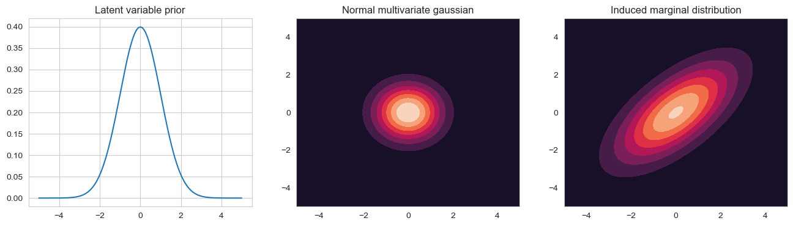

```python
import numpy as np
import matplotlib.pyplot as plt
import seaborn as sns
from scipy import stats
```

# Factor analysis

A problem with mixture models is that there is only a single latent variable, i.e. each observation can only come from one of $K$-prototypes. 
Here we now look at continious latent variables, latent variables now that come from a distribution, for example a gaussian prior

$$
\mathbf{z}_i \in \mathbb{R}^k, \quad \mathbb{P}(\mathbf{z}_i) = \mathcal{N}(\mathbf{z}_i | \mathbf{\mu}_0, \Sigma_0)
$$


For the observations $ \mathbf{x}_i \in \mathbb{R}^p $ we assume a Gaussian likelihood.
The probability then of our observations is given by 

$$
\mathbb{P}(\mathbf{x}_i | \mathbf{z}_i \mathbf{\theta}) = \mathcal{N}(W \mathbf{z}_i + \mathbf{\mu}, \Psi)
$$

where $W$ is the so called loading matrix, $ \mathbf{\mu}$ the mean and $ \Psi$ the covariance matrix. 
If we now assume that  $\Psi$ is a diagonal matrix, i.e. the different features do not covary, then we force our latent variables to explain the correlation


```python
x = np.arange(-5, 5, 0.01)

X, Y = np.meshgrid(x, x)
pos = np.dstack((X, Y))
W = np.array([
    [1, 1], 
    [1, 1]]
)
mean = np.array([0, 0])
cov = np.array([
    [1, 0], 
    [0, 1]]
) 

prior = stats.norm(0, 1)
gauss = stats.multivariate_normal(mean, cov)
post = stats.multivariate_normal(W @ mean + mean, cov + W @ cov @ W.T)

fig, axs = plt.subplots(1, 3, figsize=plt.figaspect(0.25))

axs[0].plot(x, prior.pdf(x))
axs[0].set_title('Latent variable prior')

axs[1].contourf(X, Y, gauss.pdf(pos))
axs[1].set_title('Normal multivariate gaussian')

axs[2].contourf(X, Y, post.pdf(pos))
axs[2].set_title('Induced marginal distribution')

plt.show()
```


    

    


If we take an isotropic Gaussian sprac can and slide it along the line defined by $W \mathbf{z}_i + \mathbf{\mu}$, that is we vary $ \mathbf{z}_i$ in it's prior distribution, we induce a correlated gaussian.
This induced marginal distribution $ \mathbb{P}(\mathbf{x}_i) | \mathbf{\theta} $ is given by the integral of the observed features times the latent prior.
The marginal distribution is again a gaussian

$$
\begin{align*}
    \mathbb{P}(\mathbf{x}_i | \mathbf{\theta}) 
    &= 
    \int \mathcal{N}(\mathbf{x}_i, W \mathbf{z}_i + \mathbf{\mu}, \Psi) \mathcal{N}(\mathbf{z}_i | \mathbf{\mu}_0, \Sigma_0) d \mathbf{z}_i \\
    &=
    \mathcal{N}(W \mathbf{\mu}_0 + \mathbf{\mu}, \Psi + W \Sigma_0 W^T)    
\end{align*}
$$

If we set $ \mathbf{\mu}_0 = 0 $, we can do this without loss of generality because we can always absorb $W \mathbf{\mu}_0 into \mathbf{\mu}$. We can also set $\Sigma_0 = I$ using $ \tilde{W} = W \Sigma_0^{-1/2} $. The new covariance structure then becomes

$$
Cov[\mathbf{x}|\mathbf{\theta}] = (W\Sigma_0^{-1/2}) \Sigma_0 (W\Sigma_0^{-1/2})^T + \Psi = WW^T + \Psi
$$

Instead of using the full calculated covariance matrix of $ \mathbf{x} $ which would have $O(D^2)$ parameters (accounting for the covariance between every pair of features), we use only the diagonal covariance which has $O(D)$ parameters and add factor loading matrix $WW^T$ which has $O(LD)$ parameters, we approximate the true covariance matrix by less parameters, only $O(LD + D)$. 
The FA thus approximates the covariance matrix of $ \mathbf{x} $ using a low ranke decomposition.
Our hope then is that the latent factors $z$ will reveal some underlying description about the data. 
Thus we compute the posterior over the latent variables

$$
\mathbb{P}(\mathbf{z}_i | \mathbf{x}_i \mathbf{\theta}) = \mathcal{N}(\mathbf{z}_i | \Sigma W^T \Psi^{-1} \mathbf{x}_i , \Sigma), \quad \Sigma = (I + W^T \Psi^{-1} W)^{-1}
$$

The mean of this distribution are called the latent scores, or latent factors.

Using the FA, we want maybe a large dataset with many variables and inputs to be visible in a lower dimension, i.e. we want to reduce the complexity and increase the visibility of dependecies of high dimensional features in a lower dimension. 
After obtaining our model we can try to understand the meaning of our latent factors by projecting the unit vectors of different feature space into the lower dimension and see how they vary along the axis.

# PCA

Given $n$ data points in $p$ dimensions 

$$
X = 
\begin{pmatrix} - & \mathbf{x}_1 & - \\ & \vdots & \\ - & \mathbf{x}_n & - \end{pmatrix} 
\in \mathbb{R}^{n \times p}
$$

we want to reduce dimensionality from $p$ to $k$ that is we want to reduce our feature space (Simplify the model). For that we choose $k$ directions $ \mathbf{w}_1, ..., \mathbf{w}_k $, arrange them as columsn in a matrix $W$

$$
W = 
\begin{pmatrix} | &  & | \\  \mathbf{w}_1 & \cdots & \mathbf{w}_k \\ | &  & |  \end{pmatrix} 
\in \mathbb{R}^{p \times k}
$$

For each column we compute then the similarity $z_j = \mathbf{w}_j^T \mathbf{x}$, that is we project $ \mathbf{x} $ down to  $ \mathbf{z} = (z_1, ..., z_k)^T  = W^T \mathbf{x} $.
The $W$ projection marix works as a encoder ($ \mathbf{z} = W^T \mathbf{x} $) and decoder ($ \tilde{\mathbf{x}} = W \mathbf{z} $). 
If now $k=p$ then $W^T + W^{-1}$ because $W$ is orthonormal ($W^T W = I$) and encoding can be undone without loss of information.
If $k < p$ we use the pseudo inverse and the reconstruction error will be non-zero.
In general we want to minimize the reconstruction error

$$
\min_{W\in \mathbb{R}^{p \times k}:W^T W = I} \sum_{i=1}^n ||\mathbf{x}_i - WW^T \mathbf{x}_i||^2
$$ 

Because the projection vectors are orthogonal to each other we can look at each of them seperately

$$
\min_{\mathbf{w}: ||\mathbf{w}||=1} \sum_{i=1}^n ||\mathbf{x}_i - \mathbf{w}\mathbf{w}^T \mathbf{x}_i ||^2
$$

$$
\begin{align*}
    \sum_{i} ||\mathbf{x}_i - \mathbf{w}\mathbf{w}^T \mathbf{x}_i ||^2
    &=
    \sum_i [\mathbf{x}_i^T \mathbf{x}  - 2 \mathbf{x}_i^T \mathbf{w}\mathbf{w}^T \mathbf{x}_i + \mathbf{x}_i^T \mathbf{w}\mathbf{w}^T \mathbf{w}\mathbf{w}^T \mathbf{x}_i] \\
    &=
    \sum_i [\mathbf{x}_i^T \mathbf{x}  -  \mathbf{x}_i^T \mathbf{w}\mathbf{w}^T \mathbf{x}_i] \\
    &=
    \sum_i \mathbf{x}_i^T \mathbf{x}_i - \mathbf{w}^T X^T X \mathbf{w}
\end{align*}
$$

Thus we want to maximize $ \mathbf{w}^T X^T X \mathbf{w} $ under the constraint $ ||\mathbf{w}|| = 1 $. 
We can also maximize the ratio 

$$
J(\mathbf{w}) = \frac{\mathbf{w}^T X^T X \mathbf{w} }{\mathbf{w}^T \mathbf{w} }
$$

The optimal projection is then the eigenvector of $X^T X$ with the largest eigenvalue. The columns of $W$ are thus the eigenvectors of $X^T X$ and they are called the principle components.

# Probalistic PCA

If we assume in our FA model that the covariance matrix is just a scaled identity matrix, i.e. $\Psi = \sigma^2 I$ where every component has the same variance, we get the so called probalistic Principle Component analysis (PCA). 

$$
\begin{align*}
    \mathbb{P}(\mathbf{x}_i | \mathbf{z}_i , \mathbf{\theta}) &= \mathcal{N}(W \mathbf{z}_i, \sigma^2 I) \\
    \Rightarrow \mathbb{P}(\mathbf{x}_i | \mathbf{\theta}) &= \int \mathcal{N}(\mathbf{x}_i , W \mathbf{z}_i, \sigma^2 I) \mathcal{N}\mathbf{z}_i | 0, I) d \mathbf{z}_i \\
    &= \mathcal{N}(\mathbf{x}_i | 0, \sigma^2 I + W W ^T) 
\end{align*}
$$

The maxima of this marginal likelihood is given by 

$$
\hat{W} = V(\Lambda - \sigma^2 I)^{\frac{1}{2}} R
$$

Where $R$ is an arbitrary orthogonal matrix, the columns of $V$ are the first k eigenvectors of $S = \frac{1}{n} X^T X $ and $\Lambda$ is a diagonal matrix containing the corresponding eigenvalues.
For $\sigma^2 \rightarrow 0$, because $R$ is an arbitrary orthogonal matrix, we set $R = \Lambda^{-\frac{1}{2}}$ which gives us that $\hat{W} \rightarrow V$, which is the classical PCA solution.

The projections $ \mathbf{z}_i $ are the posterior over the latent factors

$$
\begin{align*}
    \mathbb{P}(\mathbf{z}_i | \mathbf{x}_i, \hat{\mathbf{\theta}}) 
    &=
    \mathcal{N}(\mathbf{z}_i | \hat{F}^{-1} \hat{W} \mathbf{x}_i, \sigma^2 \hat{F}^{-1}), \quad \hat{F} = \sigma^2 I + \hat{W}^T \hat{W}
\end{align*}
$$

For $\sigma^2 \rightarrow 0$, $ \mathbf{z}_i \rightarrow \hat{F}^{-1} \hat{W} \mathbf{x}_i$ and $\hat{F}^{-1} \hat{W} \mathbf{x}_i \rightarrow (V^T V)^{-1} V^T \mathbf{x}_i = V^T  \mathbf{x}_i$. 
This is the orthognonal projection of the data onto the column space of V as in classical PCA.

# CCA

We consider that we have paired samples, where each pai can be viewed from a different view. 
We then would like to ask, what is the dependency structure between these two views. 
Global linear dependecies (linear relationships among vectors) can then be detected by CCA.

Assume that each data point consists of two views $X$ and $Y$. 
For example for images $X$ might be the image and $Y$ the label / text belonging to that image.

We would like to reduce the dimensionality of the two views jointly, i.e. find the projections such that the projected views are maximally correlated.

Let $ \mathbf{X} \in \mathbb{R}^{p_x}$ be a random vector and $ \mathbf{Y} \in \mathbb{R}^{p_y} $ be a random vector. Consider the combination $p = p_x + p_y$-dimensional random vector $ \mathbf{Z} = (\mathbf{X}, \mathbf{Y})^T $. Let it's $p \times p$ covariance matrix be partitioned into block according to

$$
Z = 
\begin{bmatrix} 
    \Sigma_{XX} & \Sigma_{XY} \\
    \Sigma_{YX} & \Sigma_{YY} \\
\end{bmatrix}
$$ 

Assuming centered data, the covariances can be estimated by the observed data $X \in \mathbb{R}^{n \times p_x}$, $Y \in \mathbb{R}^{n \times p_y}$

$$
Z \approx
\frac{1}{n}
\begin{bmatrix} 
    X^T X & X^T Y \\
    Y^T X & Y^T Y 
\end{bmatrix}
$$

The definition of correlation is given by

$$
\rho = cor(x, y) = \frac{cov(x, y)}{var(x) var(y)}
$$

and the sample correlation is 

$$
\rho = \frac{\sum_i (x_i - \bar{x})(y_i - \bar{y})^T}{\sqrt{\sum_i (x_i - \bar{x})^2 \sum_i (y_i - \bar{y})^2}} = \frac{\mathbf{x}^T \mathbf{y}}{\sqrt{\mathbf{x}^T \mathbf{x}}\sqrt{\mathbf{y}^T \mathbf{y}}}
$$

We want to find maximally correlated projections where we project $ \mathbf{x} $ onto $ \mathbf{a} $ and $ \mathbf{y} $ onto $ \mathbf{b} $ such their correlation is maximum.
The projected covariance is given by $cov(\mathbf{x}^T \mathbf{a}, \mathbf{y}^T \mathbf{b}) = \mathbf{a}^T \Sigma_{XY} \mathbf{b}$. 
If we set $ \mathbf{c} = \Sigma_{XX}^{1/2} \mathbf{a} $ and $ \mathbf{d} = \Sigma_{YY}^{1/2} \mathbf{b} $ the then projected correlation coefficient is 

$$
\rho 
=
\frac{\mathbf{c}^T \Sigma_{XX}^{-1/2} \Sigma_{XY} \Sigma_{YY}^{-1/2} \mathbf{d}}{\sqrt{\mathbf{c}^T\mathbf{c}} \sqrt{\mathbf{d}^T\mathbf{d}}} 
$$

Using the cauchy schwarz inequality 

$$
 \mathbf{x}^T \mathbf{y} \leq ||\mathbf{x}|| ||\mathbf{y}|| 
$$ 
  
we get 

$$
\begin{align*}
    \left( \mathbf{c}^T \underbrace{\Sigma_{XX}^{-1/2} \Sigma_{XY} \Sigma_{YY}^{-1/2}}_{=:H}  \right) \mathbf{d}
    &\leq 
    \left(  \mathbf{c}^T \underbrace{H H^T}_{=:G} \mathbf{c}  \right)^{1/2} (\mathbf{d}^T \mathbf{d})^{1/2} \\
    \Rightarrow
    \rho &\leq \frac{\left( \mathbf{c}^T G \mathbf{c} \right)^{1/2}}{(\mathbf{c}^T \mathbf{c})^{1/2}} \\
    \rho^2 &\leq \frac{\left( \mathbf{c}^T G \mathbf{c} \right)}{(\mathbf{c}^T \mathbf{c})}
\end{align*}
$$

This expression is equal if the vectors $ \mathbf{d} $ and  $\Sigma_{YY}^{-1/2} \Sigma_{YX} \Sigma_{XX}^{-1/2} \mathbf{c} $ are collinear, i.e. they point in the same direction. 
At that point the correlation atains it's maximum.
The right side is maximised when $ \mathbf{c} $ is the eigenvector with the largest eigenvalue of $G$.
As subsequent pairs we use the eigenvalues in decreasing magnitudes.
Having $ \mathbf{c} $ and knowing that the correlation is maximised when the two previously mentioned vectors are collinear, we get that

$$
\mathbf{d} \propto  \Sigma_{YY}^{-1/2} \Sigma_{YX} \Sigma_{XX}^{-1/2} \mathbf{c}
$$

Transforming back to our original variables gives $ \mathbf{a} = \Sigma_{XX}^{-1/2}  \mathbf{c} $, $ \mathbf{b} = \Sigma_{YY}^{-1/2} \mathbf{d} $.

# Probabilistic CCA


Our two variables $ \mathbf{x}_i $ and $ \mathbf{y}_i $ are influenced by a shared latent variable $ \mathbf{z}^s_i $ and their own corresponding latent variables. Each also having their own projection matrix

Now with a gaussian priors

$$
\mathbb{P}(\mathbf{z}) = \mathcal{N}(\mathbf{z}^s | 0, I) \mathcal{N}(\mathbf{z}^x | 0, I) \mathcal{N}(\mathbf{z}^y | 0, I)
$$

the MLE in the two view-FA model is equivalent to classical CCA (up to rotation and scaling)


the shared latent variable $ \mathbf{z}_i^s $ decorrelates the two views

$$
\begin{align*}
    \mathbf{x} \in \mathbb{R}^p, y \in \mathbb{R}^q \\
    \mathbf{z}^S \sim \mathcal{N}(\mathbf{z}^S | 0, I) \\
    (\mathbf{x}, \mathbf{y}) | \mathbf{z} \sim \mathcal{N}_{p+q}(\mu_z, \Sigma), \quad \Sigma = \begin{pmatrix} \Sigma_x & 0 \\ 0 & \Sigma_y  \end{pmatrix}
\end{align*}
$$

The presence of the shared latent variable $ \mathbf{z}^S $ decorrelates $\mathbf{x}$ and $ \mathbf{y}$. In other words, once we know $ \mathbf{z}^S $, the residual dependencies between $\mathbf{x}$ and $\mathbf{y}$ vanish.
This property is crucial in CCA, where the goal is to find linear combinations of $\mathbf{x}$ and $\mathbf{y}$ that are maximally correlated. The latent variable approach provides a probabilistic model to achieve this.
The shared latent variable $ \mathbf{z}^S $ can be thought of as capturing the common source of variation between $ \mathbf{x} $ and $ \mathbf{y} $.

# Further connections

* If $\mathbf{y}$ is a discrete class label, then CCA is equivalent to LDA.
* If $\mathbf{y}$ is arbitrary, then CCA is equivalent to the Gaussian information bottlneck
    * Compress $\mathbf{x}$ into compact latent representation while preserving information about $\mathbf{y}$
    * Find encoding distribution $ \mathbb{P}(\mathbf{z}|\mathbf{x}) $ by minimizing $I(\mathbf{x}; \mathbf{z}) - \beta I(\mathbf{z}; \mathbf{y})$ where $\beta$ is some tradeoff constant between compression and predictive accuracy

* If $\mathbf{y}$ is arbitrary and we have a discrete shared latent variable $ \mathbf{z}^S $, then we get the so called dependency seeking clustering. Cluster structure expressed by the shared latent variable explains the dependency between the two views. Thus it finds a group structure which is able to explain dependecies between two representations of some underlying objects.

In general the structure of the FA is very flexible. Different assumptions about the latent spaces (continious or discrete), their priors, or about the views, many different models can be derived.
